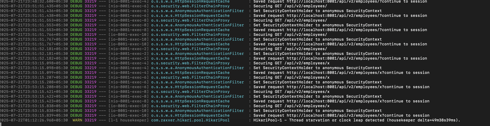

## API Gateway Microservice
- Run Inventory Service
- test

```shell
curl http://localhost:8087/api/v2/inventory/assets
```

- Run API gateway
- test
```shell
curl http://localhost:8082/inventory/api/v2/inventory/assets
```
Expected Response :
```json

[
  {
    "id": 1,
    "productCode": "M1",
    "productName": "Macbook",
    "quantity": 2,
    "warehouseLocation": "Bangalore",
    "lastUpdated": null
  },
  {
    "id": 2,
    "productCode": "M2",
    "productName": "Macbook",
    "quantity": 2,
    "warehouseLocation": "Bangalore",
    "lastUpdated": null
  },
  {
    "id": 3,
    "productCode": "M3",
    "productName": "Macbook",
    "quantity": 2,
    "warehouseLocation": "Bangalore",
    "lastUpdated": null
  }
]

```
Test Retry with a URL  without passing the authentication token

```bash
curl -i http://localhost:8082/employees/x
```

The response is with a slight delay , validate the retry in the employee-service logs

