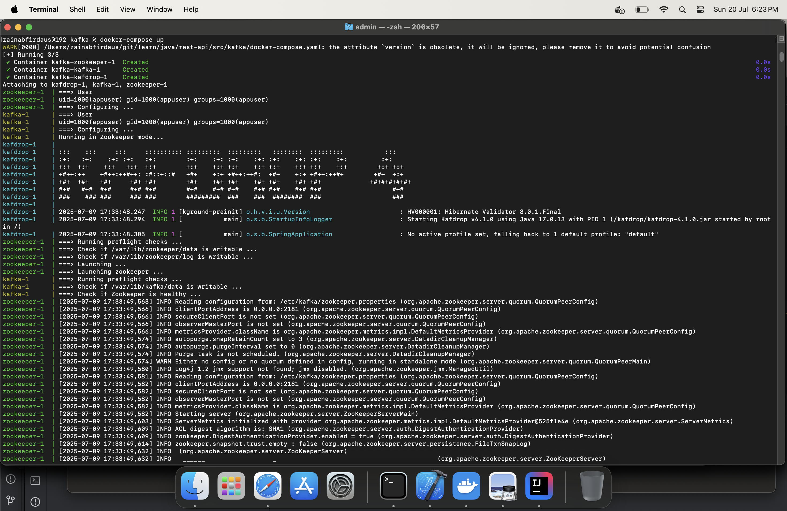

Running the project : 
1. set java to path 
2. set java_home
3. mvn spring-boot:run
4. test
http://localhost:8080/api/employees/{employeeName}
-204


Goto src/kafka
run the command : 
```shell
docker-compose up
```



