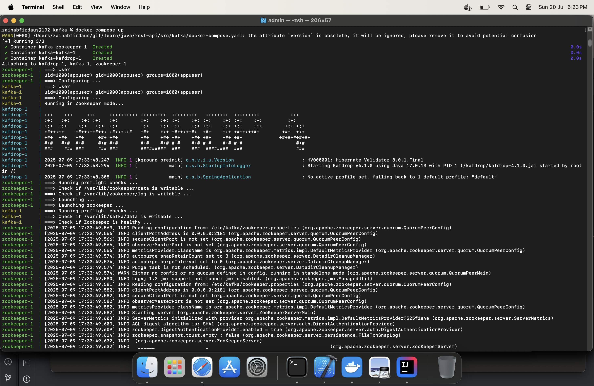
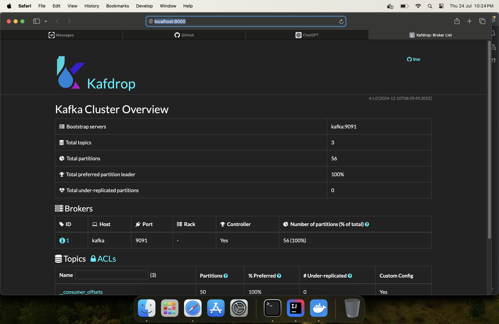

Running the project : 
1. set java to path 
2. set java_home
3. mvn spring-boot:run
4. test
http://localhost:8080/api/employees/{employeeName}
-204

Directly install Kafka : 
```shell
    brew install kafka

```

```shell
    brew install zookeeper

```
```shell
/opt/homebrew/opt/zookeeper/bin/zkServer status

ZooKeeper JMX enabled by default
Using config: /opt/homebrew/etc/zookeeper/zoo.cfg
Client port found: 2181. Client address: localhost. Client SSL: false.
Mode: standalone
```

```shell
/opt/homebrew/opt/zookeeper/bin/zkServer print-cmd

Using config: /opt/homebrew/etc/zookeeper/zoo.cfg
"/opt/homebrew/opt/openjdk/bin/java"  -Dzookeeper.log.dir="/opt/homebrew/Cellar/zookeeper/3.9.4/libexec/bin/../logs"     -Dzookeeper.log.file="zookeeper-zainabfirdaus-server-192.168.1.6.log"     -XX:+HeapDumpOnOutOfMemoryError -XX:OnOutOfMemoryError='kill -9 %p'     -cp "/opt/homebrew/Cellar/zookeeper/3.9.4/libexec/bin/../zookeeper-metrics-providers/zookeeper-prometheus-metrics/target/classes:/opt/homebrew/Cellar/zookeeper/3.9.4/libexec/bin/../zookeeper-server/target/classes:/opt/homebrew/Cellar/zookeeper/3.9.4/libexec/bin/../build/classes:/opt/homebrew/Cellar/zookeeper/3.9.4/libexec/bin/../zookeeper-metrics-providers/zookeeper-prometheus-metrics/target/lib/*.jar:/opt/homebrew/Cellar/zookeeper/3.9.4/libexec/bin/../zookeeper-server/target/lib/*.jar:/opt/homebrew/Cellar/zookeeper/3.9.4/libexec/bin/../build/lib/*.jar:/opt/homebrew/Cellar/zookeeper/3.9.4/libexec/bin/../lib/zookeeper-prometheus-metrics-3.9.4.jar:/opt/homebrew/Cellar/zookeeper/3.9.4/libexec/bin/../lib/zookeeper-jute-3.9.4.jar:/opt/homebrew/Cellar/zookeeper/3.9.4/libexec/bin/../lib/zookeeper-3.9.4.jar:/opt/homebrew/Cellar/zookeeper/3.9.4/libexec/bin/../lib/snappy-java-1.1.10.5.jar:/opt/homebrew/Cellar/zookeeper/3.9.4/libexec/bin/../lib/slf4j-api-2.0.13.jar:/opt/homebrew/Cellar/zookeeper/3.9.4/libexec/bin/../lib/simpleclient_servlet-0.9.0.jar:/opt/homebrew/Cellar/zookeeper/3.9.4/libexec/bin/../lib/simpleclient_hotspot-0.9.0.jar:/opt/homebrew/Cellar/zookeeper/3.9.4/libexec/bin/../lib/simpleclient_common-0.9.0.jar:/opt/homebrew/Cellar/zookeeper/3.9.4/libexec/bin/../lib/simpleclient-0.9.0.jar:/opt/homebrew/Cellar/zookeeper/3.9.4/libexec/bin/../lib/netty-transport-native-unix-common-4.1.119.Final.jar:/opt/homebrew/Cellar/zookeeper/3.9.4/libexec/bin/../lib/netty-transport-native-epoll-4.1.119.Final-linux-x86_64.jar:/opt/homebrew/Cellar/zookeeper/3.9.4/libexec/bin/../lib/netty-transport-classes-epoll-4.1.119.Final.jar:/opt/homebrew/Cellar/zookeeper/3.9.4/libexec/bin/../lib/netty-transport-4.1.119.Final.jar:/opt/homebrew/Cellar/zookeeper/3.9.4/libexec/bin/../lib/netty-tcnative-classes-2.0.70.Final.jar:/opt/homebrew/Cellar/zookeeper/3.9.4/libexec/bin/../lib/netty-tcnative-boringssl-static-2.0.70.Final.jar:/opt/homebrew/Cellar/zookeeper/3.9.4/libexec/bin/../lib/netty-tcnative-boringssl-static-2.0.70.Final-windows-x86_64.jar:/opt/homebrew/Cellar/zookeeper/3.9.4/libexec/bin/../lib/netty-tcnative-boringssl-static-2.0.70.Final-osx-x86_64.jar:/opt/homebrew/Cellar/zookeeper/3.9.4/libexec/bin/../lib/netty-tcnative-boringssl-static-2.0.70.Final-osx-aarch_64.jar:/opt/homebrew/Cellar/zookeeper/3.9.4/libexec/bin/../lib/netty-tcnative-boringssl-static-2.0.70.Final-linux-x86_64.jar:/opt/homebrew/Cellar/zookeeper/3.9.4/libexec/bin/../lib/netty-tcnative-boringssl-static-2.0.70.Final-linux-aarch_64.jar:/opt/homebrew/Cellar/zookeeper/3.9.4/libexec/bin/../lib/netty-resolver-4.1.119.Final.jar:/opt/homebrew/Cellar/zookeeper/3.9.4/libexec/bin/../lib/netty-handler-4.1.119.Final.jar:/opt/homebrew/Cellar/zookeeper/3.9.4/libexec/bin/../lib/netty-common-4.1.119.Final.jar:/opt/homebrew/Cellar/zookeeper/3.9.4/libexec/bin/../lib/netty-codec-4.1.119.Final.jar:/opt/homebrew/Cellar/zookeeper/3.9.4/libexec/bin/../lib/netty-buffer-4.1.119.Final.jar:/opt/homebrew/Cellar/zookeeper/3.9.4/libexec/bin/../lib/metrics-core-4.1.12.1.jar:/opt/homebrew/Cellar/zookeeper/3.9.4/libexec/bin/../lib/logback-core-1.3.15.jar:/opt/homebrew/Cellar/zookeeper/3.9.4/libexec/bin/../lib/logback-classic-1.3.15.jar:/opt/homebrew/Cellar/zookeeper/3.9.4/libexec/bin/../lib/jline-2.14.6.jar:/opt/homebrew/Cellar/zookeeper/3.9.4/libexec/bin/../lib/jetty-util-ajax-9.4.57.v20241219.jar:/opt/homebrew/Cellar/zookeeper/3.9.4/libexec/bin/../lib/jetty-util-9.4.57.v20241219.jar:/opt/homebrew/Cellar/zookeeper/3.9.4/libexec/bin/../lib/jetty-servlet-9.4.57.v20241219.jar:/opt/homebrew/Cellar/zookeeper/3.9.4/libexec/bin/../lib/jetty-server-9.4.57.v20241219.jar:/opt/homebrew/Cellar/zookeeper/3.9.4/libexec/bin/../lib/jetty-security-9.4.57.v20241219.jar:/opt/homebrew/Cellar/zookeeper/3.9.4/libexec/bin/../lib/jetty-io-9.4.57.v20241219.jar:/opt/homebrew/Cellar/zookeeper/3.9.4/libexec/bin/../lib/jetty-http-9.4.57.v20241219.jar:/opt/homebrew/Cellar/zookeeper/3.9.4/libexec/bin/../lib/javax.servlet-api-3.1.0.jar:/opt/homebrew/Cellar/zookeeper/3.9.4/libexec/bin/../lib/jackson-databind-2.15.2.jar:/opt/homebrew/Cellar/zookeeper/3.9.4/libexec/bin/../lib/jackson-core-2.15.2.jar:/opt/homebrew/Cellar/zookeeper/3.9.4/libexec/bin/../lib/jackson-annotations-2.15.2.jar:/opt/homebrew/Cellar/zookeeper/3.9.4/libexec/bin/../lib/commons-io-2.17.0.jar:/opt/homebrew/Cellar/zookeeper/3.9.4/libexec/bin/../lib/commons-cli-1.5.0.jar:/opt/homebrew/Cellar/zookeeper/3.9.4/libexec/bin/../lib/audience-annotations-0.12.0.jar:/opt/homebrew/Cellar/zookeeper/3.9.4/libexec/bin/../zookeeper-*.jar:/opt/homebrew/Cellar/zookeeper/3.9.4/libexec/bin/../zookeeper-server/src/main/resources/lib/*.jar:/opt/homebrew/etc/zookeeper:" -Xmx1000m   -Dcom.sun.management.jmxremote -Dcom.sun.management.jmxremote.local.only=false org.apache.zookeeper.server.quorum.QuorumPeerMain "/opt/homebrew/etc/zookeeper/zoo.cfg" > "/opt/homebrew/Cellar/zookeeper/3.9.4/libexec/bin/../logs/zookeeper-zainabfirdaus-server-192.168.1.6.out" 2>&1 < /dev/null
```

```shell
    brew services start kafka

```

Goto src/kafka
run the command : 
```shell
docker-compose up
```



Try the URL : http://localhost:9000

