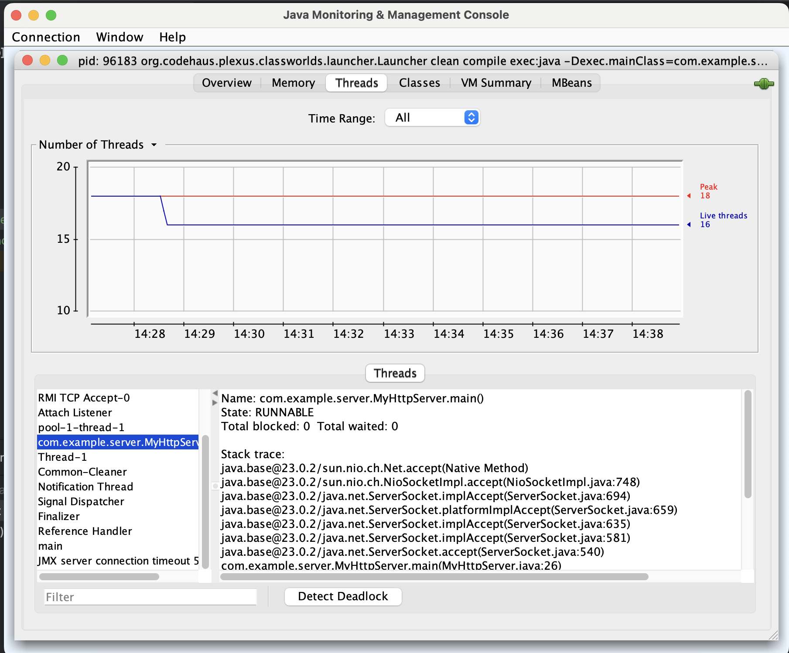
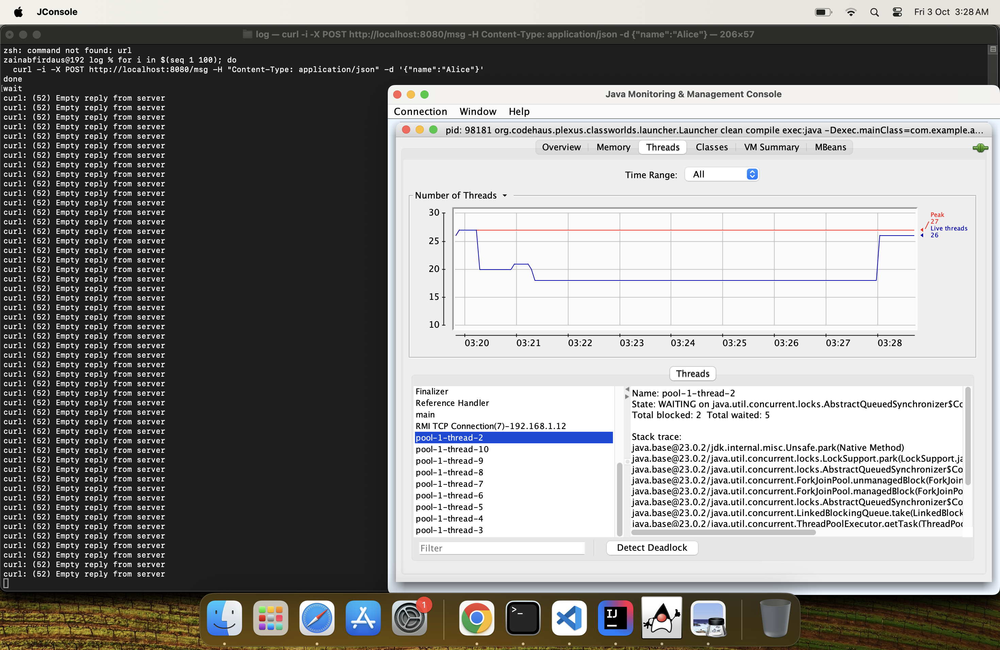

```shell

mvn clean compile exec:java -Dexec.mainClass="com.example.lock.LockDemo"

```

```shell

mvn clean compile exec:java -Dexec.mainClass="com.example.app.App"

```
```shell
curl http://localhost:8080/
```
Template :
```html
<Request-Line>
<Header1>
<Header2>
...
<HeaderN>

<Body (optional)>

```

```html
<h1>Hello from the Java Server!</h1>
```

```shell
curl -i -X POST http://localhost:8080/msg -H "Content-Type: application/json" -d '{"name":"Alice"}'

```
```shell
for i in $(seq 1 100); do
  curl -i -X POST http://localhost:8080/msg -H "Content-Type: application/json" -d '{"name":"Alice"}'
done
wait
```

```shell
seq 1 100 | xargs -n1 -P50 -I{} \
  curl -s -o /dev/null -w "%{http_code} %{time_total}\n" "http://example.com/api"
```

```shell 
jconsole
```



