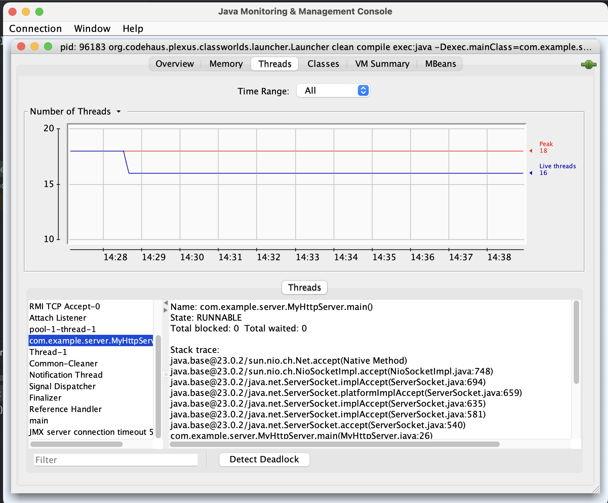
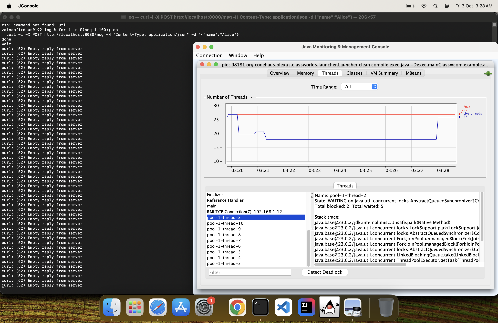
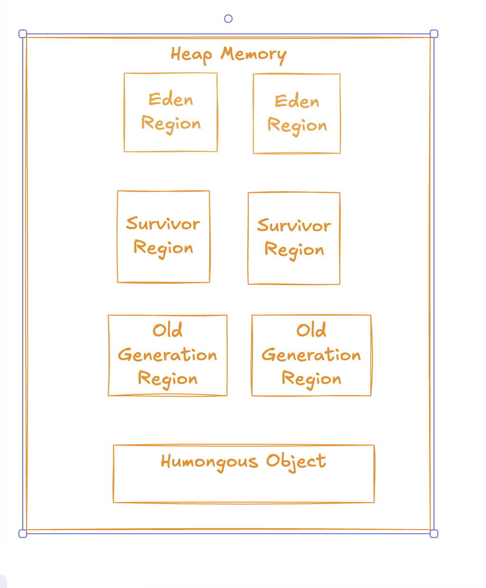
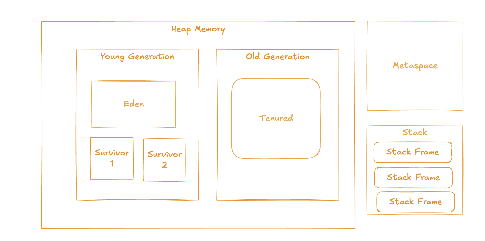

```shell

mvn clean compile exec:java -Dexec.mainClass="com.example.lock.LockDemo"

```

```shell

mvn clean compile exec:java -Dexec.mainClass="com.example.app.App"

```

### Proxy Pattern

| Class | Description |
|---|---|
| [DatabaseService](src/main/java/com/example/proxy/DatabaseService.java) | Interface defining database operations |
| [RealDatabaseService](src/main/java/com/example/proxy/RealDatabaseService.java) | Real implementation with simulated delays |
| [CachingProxy](src/main/java/com/example/proxy/CachingProxy.java) | Adds in-memory caching layer |
| [SecurityProxy](src/main/java/com/example/proxy/SecurityProxy.java) | Adds role-based access control |
| [DynamicProxyExample](src/main/java/com/example/proxy/DynamicProxyExample.java) | Runtime logging proxy via Java reflection |
| [ProxyTest](src/main/java/com/example/proxy/ProxyTest.java) | Test class demonstrating all proxy types |

```shell
mvn clean compile exec:java -Dexec.mainClass="com.example.proxy.ProxyTest"
```

```shell
curl http://localhost:8080/
```
Template :
```html
<Request-Line>
<Header1>
<Header2>
...
<HeaderN>

<Body (optional)>

```

```html
<h1>Hello from the Java Server!</h1>
```

```shell
curl -i -X POST http://localhost:8080/msg -H "Content-Type: application/json" -d '{"name":"Alice"}'

```
```shell
for i in $(seq 1 100); do
  curl -i -X POST http://localhost:8080/msg -H "Content-Type: application/json" -d '{"name":"Alice"}'
done
wait
```

```shell
seq 1 100 | xargs -n1 -P50 -I{} \
  curl -s -o /dev/null -w "%{http_code} %{time_total}\n" "http://example.com/api"
```

```shell 
jconsole
```





### Java Memory Simplified : 





### Reenterant Lock
- Fair Lock : Longest waiting thread acquires the lock
```shell
Thread-1 acquired the lock.
Thread-1 releasing the lock.
Thread-3 acquired the lock.
Thread-3 releasing the lock.
Thread-2 acquired the lock.
Thread-2 releasing the lock.
Thread-1 acquired the lock.
Thread-1 releasing the lock.
Thread-3 acquired the lock.
Thread-3 releasing the lock.
Thread-2 acquired the lock.
Thread-2 releasing the lock.
Thread-1 acquired the lock.
Thread-1 releasing the lock.
Thread-3 acquired the lock.
Thread-3 releasing the lock.
Thread-2 acquired the lock.
Thread-2 releasing the lock.
Process finished with exit code 0
```
- Unfair Lock - Any thread can acquire the lock 
- Benefit : Improves Throughput
```shell
Thread-1 acquired the lock.
Thread-1 releasing the lock.
Thread-1 acquired the lock.
Thread-1 releasing the lock.
Thread-1 acquired the lock.
Thread-1 releasing the lock.
Thread-2 acquired the lock.
Thread-2 releasing the lock.
Thread-2 acquired the lock.
Thread-2 releasing the lock.
Thread-2 acquired the lock.
Thread-2 releasing the lock.
Thread-3 acquired the lock.
Thread-3 releasing the lock.
Thread-3 acquired the lock.
Thread-3 releasing the lock.
Thread-3 acquired the lock.
Thread-3 releasing the lock.
```

### Without using Reenterant Lock 
- Multiple thread modifies the same data
```shell
Thread-1 acquired the lock.
Thread-3 acquired the lock.
Thread-2 acquired the lock.
Thread-3 releasing the lock.
Thread-3 acquired the lock.
Thread-1 releasing the lock.
Thread-1 acquired the lock.
Thread-2 releasing the lock.
Thread-2 acquired the lock.
Thread-1 releasing the lock.
Thread-1 acquired the lock.
Thread-2 releasing the lock.
Thread-2 acquired the lock.
Thread-3 releasing the lock.
Thread-3 acquired the lock.
Thread-3 releasing the lock.
Thread-1 releasing the lock.
Thread-2 releasing the lock.
```

Debugging a **Maven project in IntelliJ IDEA** is straightforward. Here’s a step-by-step guide:

---

### **1. Open the Maven Project**

* Open IntelliJ IDEA → `File > Open` → select the folder containing `pom.xml`.
* IntelliJ will automatically detect it as a Maven project and load dependencies.

---

### **2. Set Breakpoints**

* Open the Java class you want to debug.
* Click in the left gutter next to the line number → a red dot appears (this is a **breakpoint**).

---

### **3. Create a Run/Debug Configuration**

#### For a main class:

1. Go to `Run > Edit Configurations`.
2. Click `+` → `Application`.
3. Fill in:

    * **Name** → e.g., `Debug MyApp`.
    * **Main class** → select the class with `public static void main`.
    * **Module** → select your module.
    * **VM options / Program arguments** → optional, if needed.
4. Apply & OK.

#### For a Maven goal:

1. Go to `Run > Edit Configurations`.
2. Click `+` → `Maven`.
3. Fill in:

    * **Name** → e.g., `Debug Maven`.
    * **Working directory** → project root (contains `pom.xml`).
    * **Command line** → e.g., `clean compile exec:java` or any goal.
4. Apply & OK.

---

### **4. Start Debugging**

* Select your configuration in the top-right dropdown.
* Click the **Debug (bug icon)** button instead of Run.
* IntelliJ will start the JVM in **debug mode** and stop at breakpoints.

---

### **5. Debugging Tools**

* **Step Over (F8)** → next line in the same method.
* **Step Into (F7)** → enter method call.
* **Step Out (Shift+F8)** → exit current method.
* **Resume Program (F9)** → continue to next breakpoint.
* **Evaluate Expression (Alt+F8)** → inspect variables or call methods.

---

### **6. Optional: Remote Debugging**

* Add `-agentlib:jdwp=transport=dt_socket,server=y,suspend=n,address=5005` to JVM options.
* In IntelliJ, create a **Remote configuration** to attach to the running JVM.

