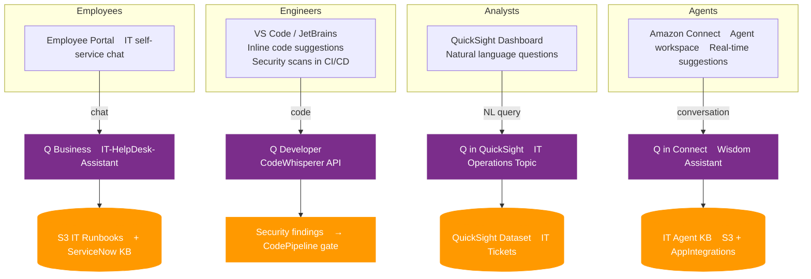
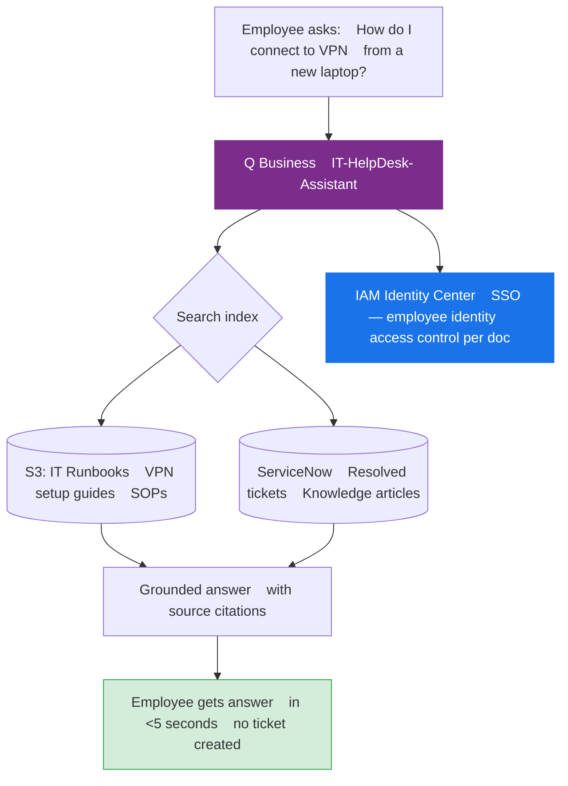
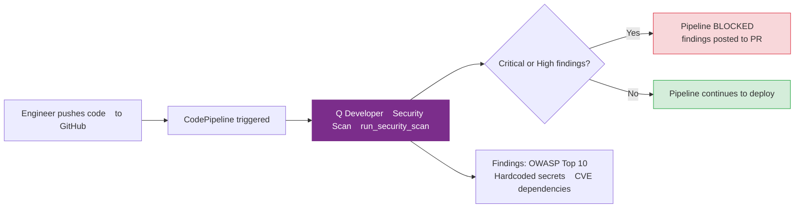
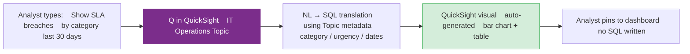
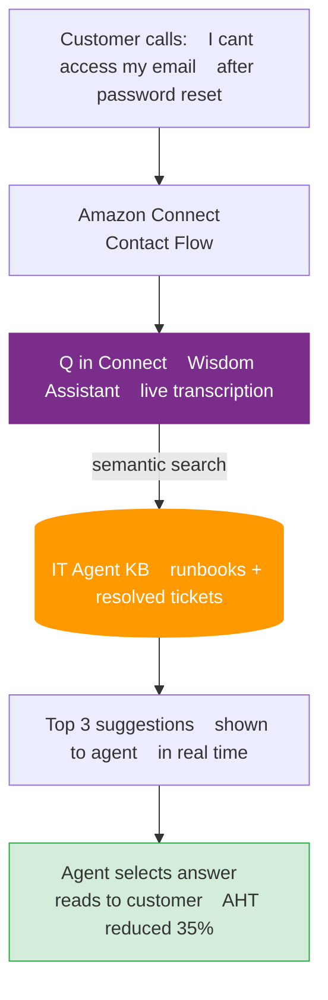
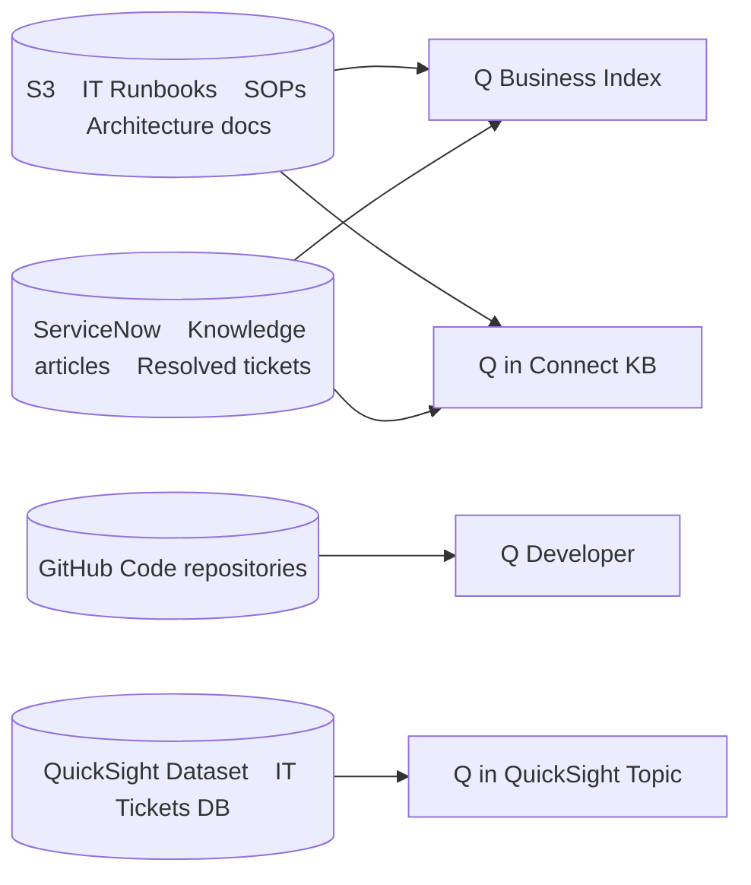
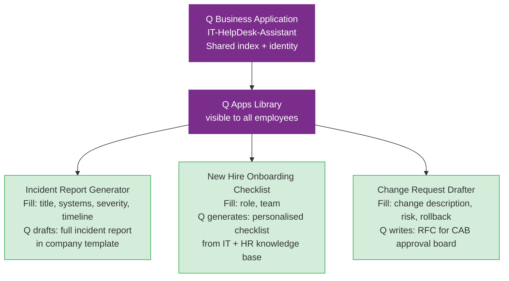
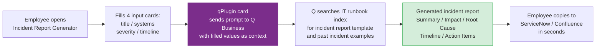

# Enterprise IT Operations Platform — Amazon Q Architecture

## Use Case

A 10,000-employee enterprise deploys all Amazon Q surfaces to solve four distinct problems:

| Problem | Amazon Q Service | Users |
|---------|-----------------|-------|
| Employees waste 2hrs/day searching IT docs | Q Business | All 10,000 employees |
| Engineers miss security issues in code reviews | Q Developer | 500 engineers |
| BI analysts wait days for custom reports | Q in QuickSight | 200 analysts |
| Support agents spend 8min searching KB per call | Q in Connect | 150 agents |

---

## High-Level Architecture — All Q Services



---

## Q Business — Employee IT Self-Service



Nightly S3 + ServiceNow sync keeps index fresh. Answers include source links so employees can read the full doc.

---

## Q Developer — CI/CD Security Gate



Engineers also get inline suggestions and chat (`/dev` agent) directly in VS Code — no API setup, just plugin install.

---

## Q in QuickSight — Natural Language BI



Topic defines friendly names (`resolution_time` → "Resolution Time"), named entities ("SLA breach"), and aggregation rules so Q understands business context.

---

## Q in Connect — Agent Real-Time Assist



`get_agent_suggestions()` is called by a Lambda in the Connect Contact Flow, passing the live conversation transcript as the query.

---

## Data Sources per Q Service



---

## Business Impact

| Metric | Before | After |
|--------|--------|-------|
| IT helpdesk tickets/day | 800 | 320 (−60%) |
| Time to find IT answer | 8–12 min | <30 sec |
| Security issues caught pre-prod | 40% | 91% |
| BI report turnaround | 2–3 days | Instant |
| Agent average handle time | 8.2 min | 5.3 min (−35%) |

---

## AWS Services Summary

| Service | API / SDK |
|---------|-----------|
| Q Business | `boto3.client("qbusiness")` |
| Q Developer | `boto3.client("codewhisperer")` + IDE plugin |
| Q in QuickSight | `boto3.client("quicksight")` Topics API |
| Q in Connect | `boto3.client("wisdom")` |
| IAM Identity Center | Employee SSO for Q Business access control |
| Amazon Connect | Contact Flow + Lambda for agent assist |
| S3 | Knowledge base document storage |
| ServiceNow | Data source connector for Q Business |
| CodePipeline | CI/CD integration for Q Developer scans |

---

## Project Structure

```
amazon_q/
├── it_operations_platform.py   # setup + orchestration for all Q services
└── ARCHITECTURE.md
```

---

## IAM Permissions

```json
{
  "Effect": "Allow",
  "Action": [
    "qbusiness:CreateApplication",
    "qbusiness:CreateIndex",
    "qbusiness:CreateDataSource",
    "qbusiness:CreateWebExperience",
    "codewhisperer:CreateCodeScan",
    "codewhisperer:ListCodeScanFindings",
    "quicksight:CreateTopic",
    "wisdom:CreateAssistant",
    "wisdom:CreateKnowledgeBase",
    "wisdom:QueryAssistant",
    "s3:GetObject",
    "s3:PutObject"
  ],
  "Resource": "*"
}
```

---

## Q Apps — Employee-Built No-Code Apps

Q Apps sit on top of Q Business. Employees create form-based apps that use the same
index and identity — no code, no API calls, built in the Q Business console or via API.

### Apps in This Platform



### How a Q App Works (Incident Report Example)



### Q Apps vs Q Business Chat

| | Q Business Chat | Q Apps |
|--|----------------|--------|
| Interface | Free-form conversation | Structured form + output |
| Best for | Open-ended questions | Repeatable, templated tasks |
| Created by | AWS | Employees (no-code) |
| Shareable | No | Yes — published to library |
| Example | "How do I reset VPN?" | "Generate incident report for this outage" |
