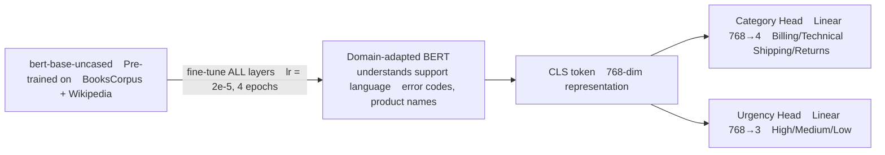
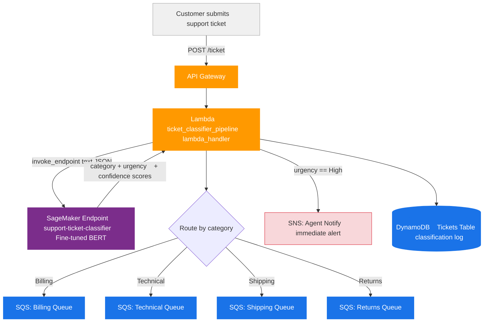
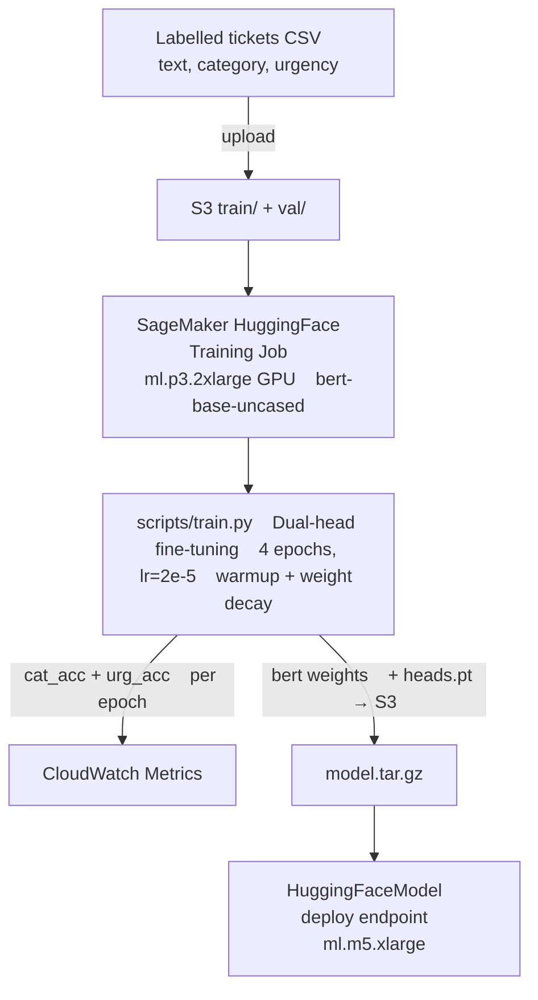
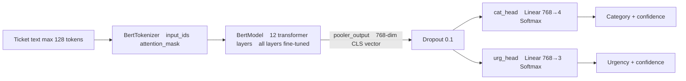

# Support Ticket Classifier — BERT Fine-Tuning Architecture

## Use Case

A SaaS company receives **~15,000 support tickets/day** across email, chat, and web form.
Manual triage takes 8–12 minutes per ticket. Misrouted tickets add 2–3 hours of resolution delay.

Fine-tuned BERT classifies each ticket in **<200ms** with **>93% accuracy** on both:
- **Category:** Billing / Technical / Shipping / Returns
- **Urgency:** High / Medium / Low

High-urgency tickets trigger immediate SNS alerts to on-call agents.

---

## Why BERT (Fine-Tuning, Not Feature Extraction)



Feature extraction would freeze BERT — it wouldn't learn domain-specific terms like
"payment failed", "kernel panic", "tracking number". Fine-tuning adapts all layers.

---

## End-to-End Architecture



---

## Training Pipeline



---

## Dual-Head Model Design



Single forward pass returns both outputs — no extra latency for dual classification.

---

## Inference Response

```json
{
  "category": "Technical",
  "urgency": "High",
  "category_confidence": 0.94,
  "urgency_confidence": 0.87,
  "category_scores": {
    "Billing": 0.02, "Technical": 0.94, "Shipping": 0.02, "Returns": 0.02
  },
  "urgency_scores": {
    "High": 0.87, "Medium": 0.11, "Low": 0.02
  }
}
```

---

## AWS Services

| Service | Role |
|---------|------|
| SageMaker HuggingFace Estimator | Fine-tune BERT on GPU (`ml.p3.2xlarge`) |
| SageMaker HuggingFace Endpoint | Real-time inference (`ml.m5.xlarge`) |
| API Gateway | Customer-facing ticket submission REST API |
| Lambda | Classify → route → notify orchestration |
| SQS (×4) | Per-category team queues with urgency message attributes |
| SNS | Immediate on-call alert for High urgency tickets |
| DynamoDB | Classification log — ticket_id, category, urgency, confidence |
| CloudWatch | Training metrics, endpoint latency alarms |

---

## Latency

| Step | Time |
|------|------|
| Tokenization | ~2ms |
| BERT forward pass (CPU `ml.m5.xlarge`) | ~120–180ms |
| SQS + DynamoDB writes | ~10ms |
| **Total p50** | **~140–200ms** |

Switch to `ml.g4dn.xlarge` (GPU) → BERT drops to ~15ms → total ~30ms.

---

## Project Structure

```
bert/
├── ticket_classifier_pipeline.py   # training + deployment + Lambda handler
├── scripts/
│   ├── train.py                    # dual-head BERT fine-tuning
│   └── inference.py                # SageMaker endpoint entry point
└── ARCHITECTURE.md
```

---

## IAM Permissions

```json
{
  "Effect": "Allow",
  "Action": [
    "sagemaker:CreateTrainingJob",
    "sagemaker:CreateModel",
    "sagemaker:CreateEndpoint",
    "sagemaker:InvokeEndpoint",
    "sqs:SendMessage",
    "sns:Publish",
    "dynamodb:PutItem",
    "s3:GetObject",
    "s3:PutObject"
  ],
  "Resource": "*"
}
```
