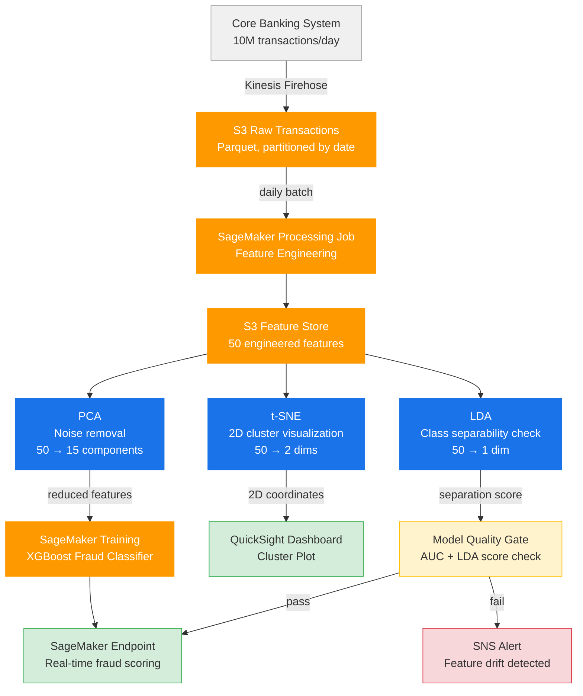
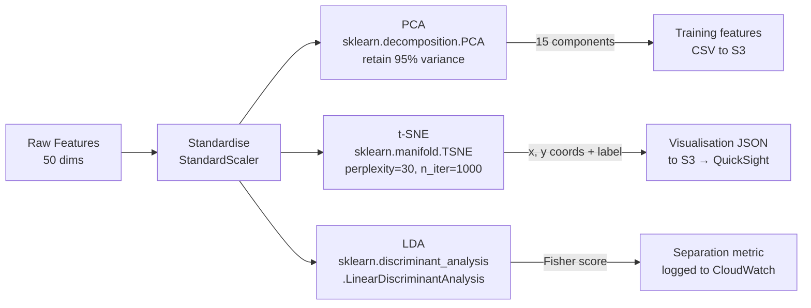
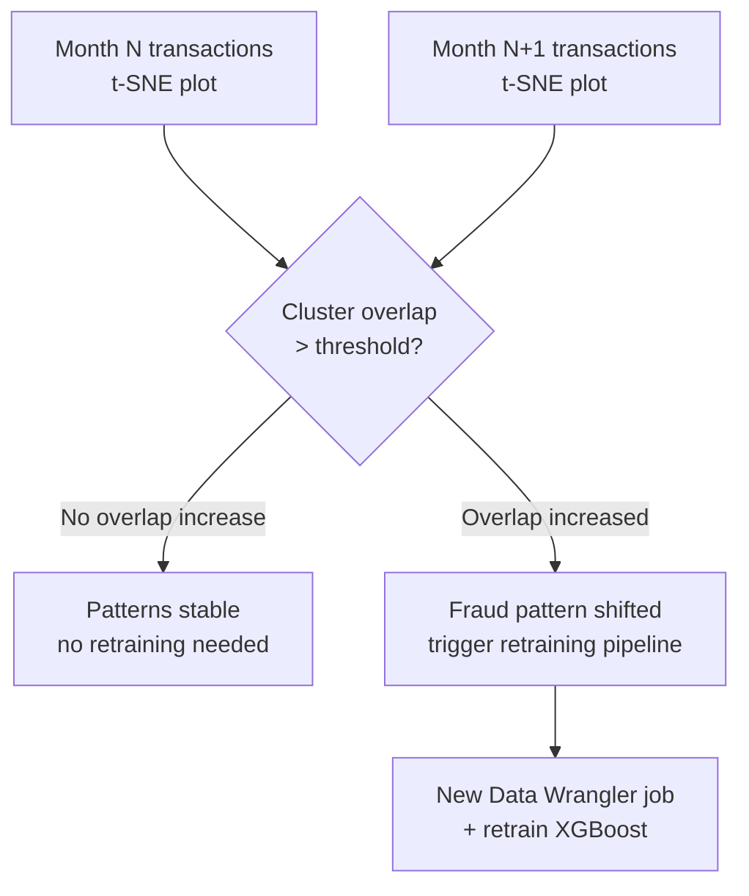

# Fraud Detection — Dimensionality Reduction & Visualization Architecture

## Use Case

A bank processes ~10M transactions/day. The fraud team needs to:
1. **Understand** what fraud looks like in high-dimensional feature space (50+ features)
2. **Validate** that fraud and legitimate transactions are separable before training a classifier
3. **Monitor** for concept drift — when fraud patterns shift, clusters visually diverge

Dimensionality reduction makes this possible by compressing 50 features into 2–3 dimensions for human interpretation.

---

## Why Each Technique

| Technique | Role in Production | When Used |
|-----------|-------------------|-----------|
| **PCA** | Fast linear compression, noise removal, speeds up downstream model | Pre-processing before training |
| **t-SNE** | Non-linear 2D visualization of transaction clusters | Exploratory analysis, drift detection |
| **LDA** | Maximizes class separability (fraud vs legit) — supervised | Validating feature quality before model training |

---

## End-to-End Architecture

---

## Processing Pipeline Detail

---

## Drift Detection with t-SNE (Monthly)

---

## Feature Space — What Gets Reduced

| Feature Group | Count | Examples |
|---------------|-------|---------|
| Transaction metadata | 8 | amount, currency, channel, time_of_day |
| Merchant signals | 7 | merchant_category, country_risk_score |
| Velocity features | 12 | txn_count_1h, amount_sum_24h, unique_merchants_7d |
| Behavioural baseline | 15 | deviation from customer avg amount, location entropy |
| Device / network | 8 | device_age, ip_risk_score, vpn_flag |
| **Total** | **50** | → PCA reduces to 15, t-SNE to 2 |

---

## Infrastructure

| Component | Service | Config |
|-----------|---------|--------|
| Ingestion | Kinesis Firehose | Buffer: 5min / 128MB |
| Storage | S3 + Glue Catalog | Parquet, partitioned `year/month/day` |
| Feature engineering | SageMaker Processing | `ml.m5.4xlarge` × 2 |
| PCA / LDA | SageMaker Processing | `ml.m5.2xlarge` × 1 |
| t-SNE | SageMaker Processing | `ml.m5.4xlarge` × 1 (CPU-intensive) |
| Training | SageMaker Training | `ml.m5.2xlarge` × 1 |
| Endpoint | SageMaker Endpoint | `ml.m5.large`, auto-scale 2–8 |
| Visualisation | Amazon QuickSight | SPICE dataset refreshed daily |
| Alerting | SNS + CloudWatch | LDA Fisher score threshold alarm |

---

## Production Value

- **PCA** cuts training time by ~60% (50 → 15 features) with <2% AUC loss
- **t-SNE** lets fraud analysts visually confirm new fraud rings before they hit the model
- **LDA** acts as a cheap pre-check — if Fisher score drops, features have degraded and retraining is triggered automatically, without waiting for model AUC to degrade in production
