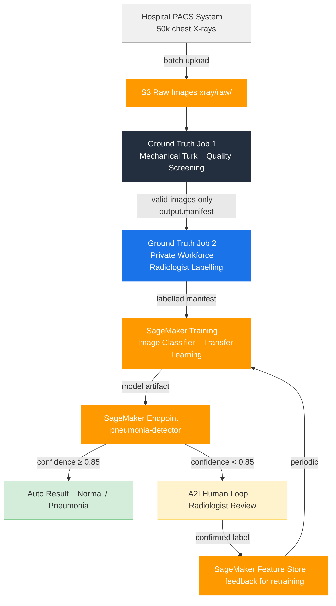
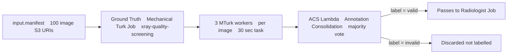
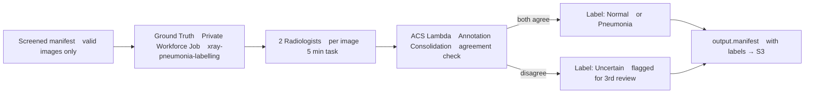
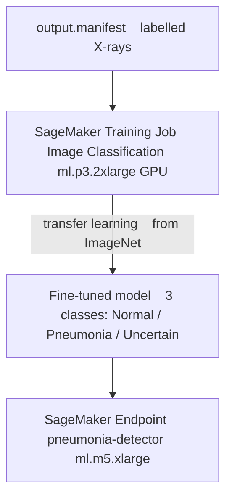
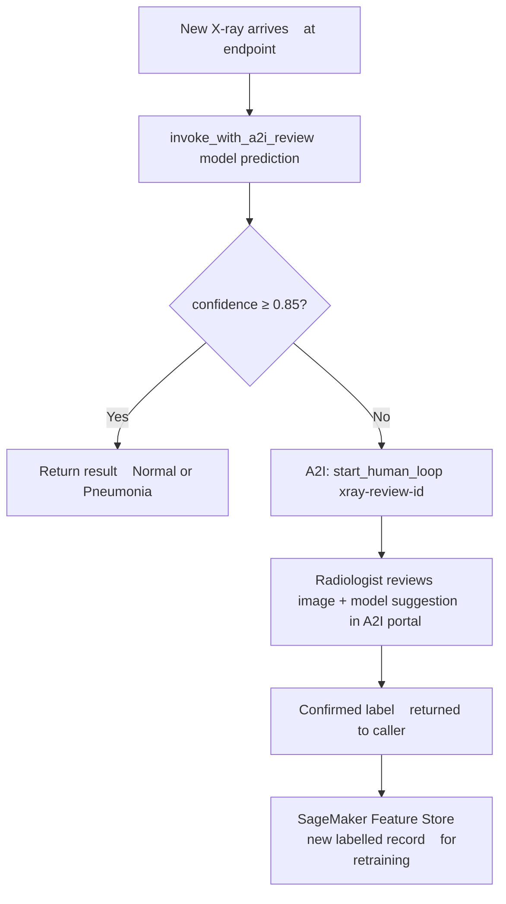

# Medical X-Ray Labelling Pipeline — Architecture & Design

## Use Case

A hospital network builds a **pneumonia detection AI** from chest X-rays.
They have 50,000 unlabelled X-ray images. The challenge:

- Raw images include corrupt files, non-X-ray images, poor quality scans
- Only radiologists can provide medically valid labels
- Radiologist time is expensive — can't label everything manually
- Deployed model needs human oversight for uncertain predictions

This pipeline solves all four problems using Ground Truth, Mechanical Turk, private workforce, and A2I.

---

## High-Level Architecture



---

## Diagram 2 — Ground Truth Job 1: MTurk Quality Screening

Purpose: filter out corrupt, non-medical, or low-quality images before expensive radiologist time is spent.



Workers answer one question: *"Is this a valid chest X-ray suitable for medical analysis?"*
Cost: ~$0.03/image × 3 workers = $0.09/image — cheap pre-filter before radiologist cost.

---

## Diagram 3 — Ground Truth Job 2: Radiologist Labelling

Purpose: expert medical labels on validated images only.



---

## Diagram 4 — Model Training & Deployment



---

## Diagram 5 — A2I Production Review Flow

Runs at inference time for every prediction below 85% confidence.



---

## Workforce Strategy

| Workforce | Task | Cost | Turnaround |
|-----------|------|------|-----------|
| Mechanical Turk | Quality screening — valid X-ray? | ~$0.09/image | Minutes |
| Private (Radiologists) | Medical labelling — Normal / Pneumonia | ~$2–5/image | Hours |
| A2I Private Loop | Review uncertain model predictions | ~$2–5/review | Same day |

---

## AWS Services Used

| Service | Role |
|---------|------|
| S3 | Raw images, manifests, model artifacts |
| SageMaker Ground Truth | Managed labelling jobs with workforce routing |
| Mechanical Turk | Public crowd for cheap quality pre-screening |
| SageMaker Private Workforce | HIPAA-eligible radiologist labelling team |
| SageMaker Image Classification | Built-in transfer learning algorithm |
| SageMaker Endpoint | Real-time inference |
| Amazon A2I | Human review loop for low-confidence predictions |
| SageMaker Feature Store | Stores A2I-confirmed labels for retraining |

---

## Project Structure

```
sagemaker_ground_truth/
├── xray_labelling_pipeline.py   # full pipeline orchestration
└── ARCHITECTURE.md              # this file
```

---

## IAM Permissions Required

```json
{
  "Effect": "Allow",
  "Action": [
    "sagemaker:CreateLabelingJob",
    "sagemaker:CreateTrainingJob",
    "sagemaker:CreateEndpoint",
    "sagemaker:InvokeEndpoint",
    "sagemaker-a2i-runtime:StartHumanLoop",
    "sagemaker-featurestore-runtime:PutRecord",
    "s3:GetObject",
    "s3:PutObject",
    "lambda:InvokeFunction"
  ],
  "Resource": "*"
}
```
