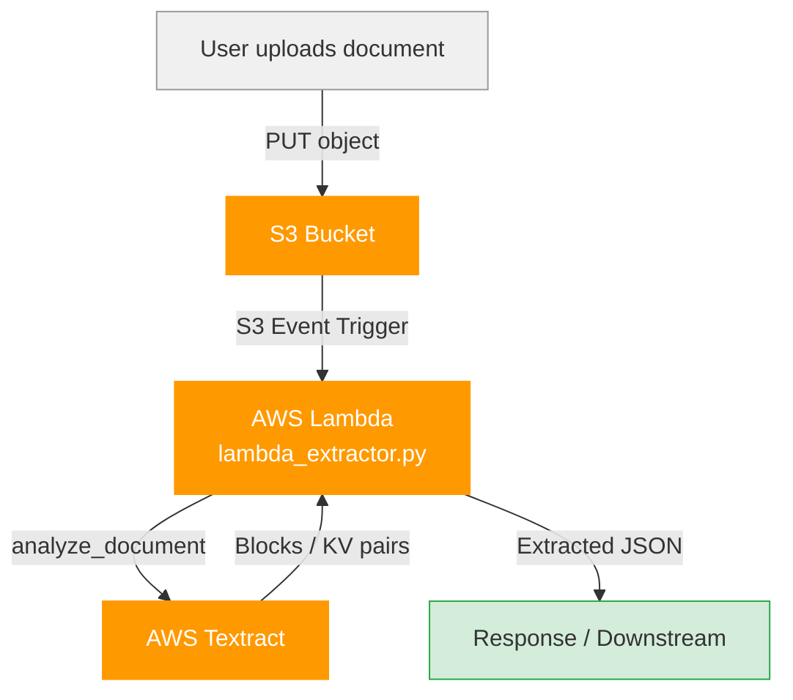
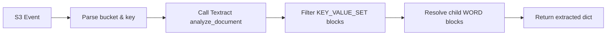

# Architecture Diagram

## Flow: S3 → Lambda → Textract → Output

## Component Roles

| Component | Role |
|-----------|------|
| S3 Bucket | Stores uploaded documents (images, PDFs) |
| Lambda | Triggered on upload; orchestrates extraction |
| Textract | Reads document, returns key-value form fields |
| Response | JSON with extracted field names and values |

## Lambda Internal Flow

