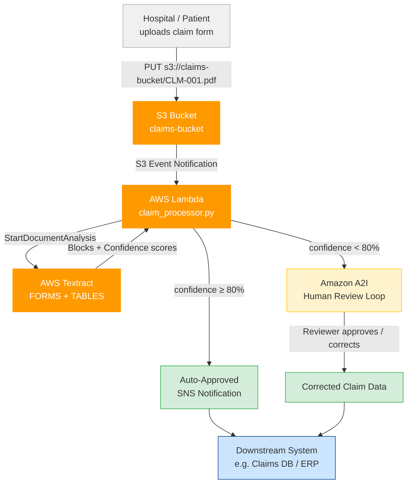
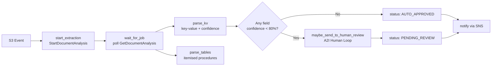
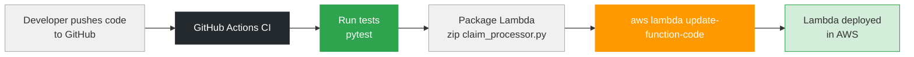

# Insurance Claim Processor — Architecture & Deployment

## Use Case

Patients or hospitals upload insurance claim forms (PDFs / scanned images) to S3.
The system automatically extracts structured data, routes low-confidence scans to
human reviewers, and notifies downstream systems.

---

## High-Level Architecture



---

## Lambda Internal Design



---

## Textract Advantages Mapped to This Project

| Advantage | Where used |
|-----------|-----------|
| No ML expertise | Managed `analyze_document` API — no model training |
| Beyond OCR | `FORMS` feature extracts `Patient Name`, `Policy No`, `Date` as KV pairs |
| Table extraction | `TABLES` feature extracts itemised procedure/cost rows |
| Complex layouts | Handles multi-column claim forms, checkboxes, handwritten fields |
| Async processing | `StartDocumentAnalysis` for multi-page PDFs — no Lambda timeout |
| Native AWS integration | S3 trigger → Lambda → Textract → SNS → A2I |
| Confidence scores | Fields below 80% routed to human review automatically |
| Structured output | Returns typed `claim` dict with per-field confidence |

---

## Deployment Pipeline



### Manual Deployment Steps

```bash
# 1. Package
zip claim_processor.zip claim_processor.py

# 2. Create Lambda (first time)
aws lambda create-function \
  --function-name ClaimProcessor \
  --runtime python3.12 \
  --role arn:aws:iam::<account-id>:role/ClaimProcessorRole \
  --handler claim_processor.lambda_handler \
  --zip-file fileb://claim_processor.zip \
  --timeout 300

# 3. Update Lambda (subsequent deploys)
aws lambda update-function-code \
  --function-name ClaimProcessor \
  --zip-file fileb://claim_processor.zip

# 4. Add S3 trigger
aws s3api put-bucket-notification-configuration \
  --bucket claims-bucket \
  --notification-configuration file://s3-trigger.json
```

### Required IAM Permissions (Lambda Role)

```json
{
  "Effect": "Allow",
  "Action": [
    "textract:StartDocumentAnalysis",
    "textract:GetDocumentAnalysis",
    "s3:GetObject",
    "sns:Publish",
    "sagemaker:StartHumanLoop"
  ],
  "Resource": "*"
}
```

### `s3-trigger.json`

```json
{
  "LambdaFunctionConfigurations": [{
    "LambdaFunctionArn": "arn:aws:lambda:us-east-1:<account-id>:function:ClaimProcessor",
    "Events": ["s3:ObjectCreated:*"],
    "Filter": {
      "Key": { "FilterRules": [{ "Name": "prefix", "Value": "claims/" }] }
    }
  }]
}
```
