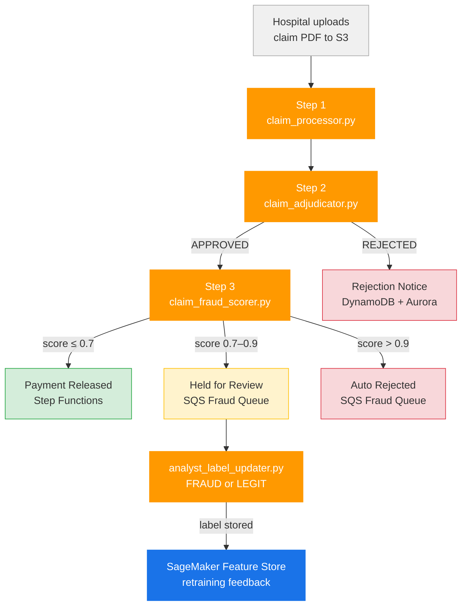
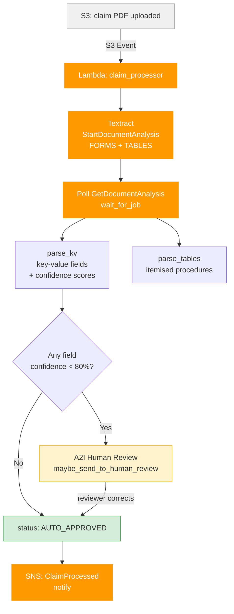
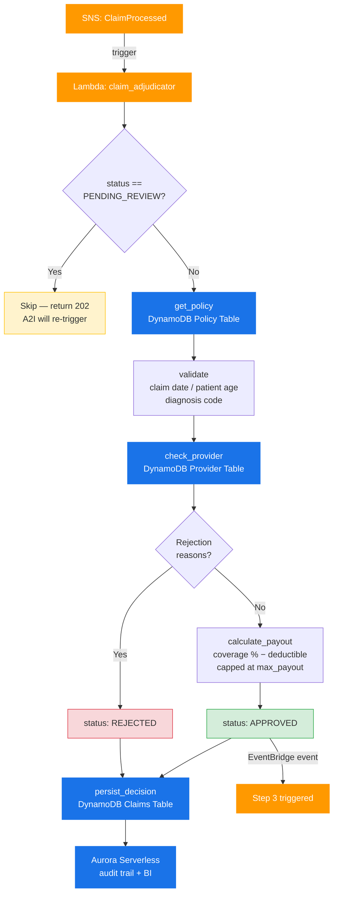
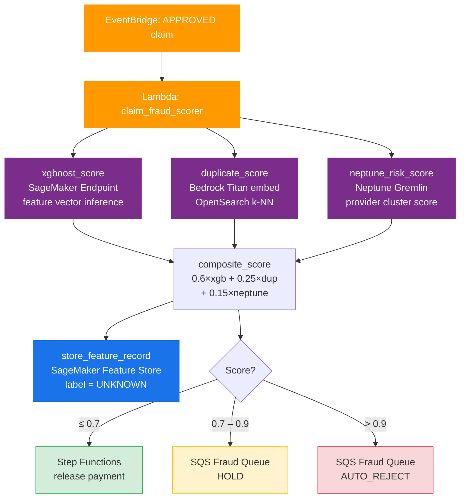
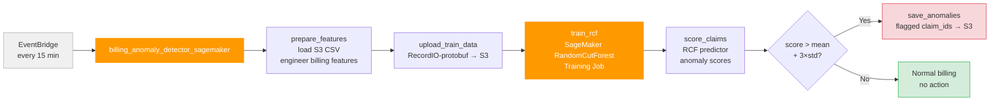
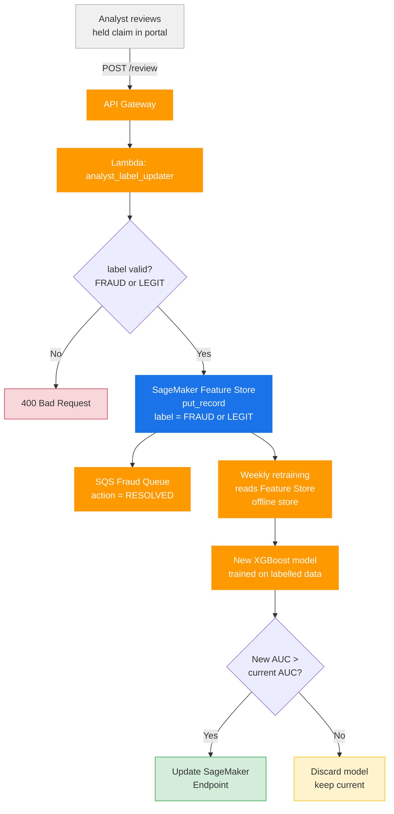
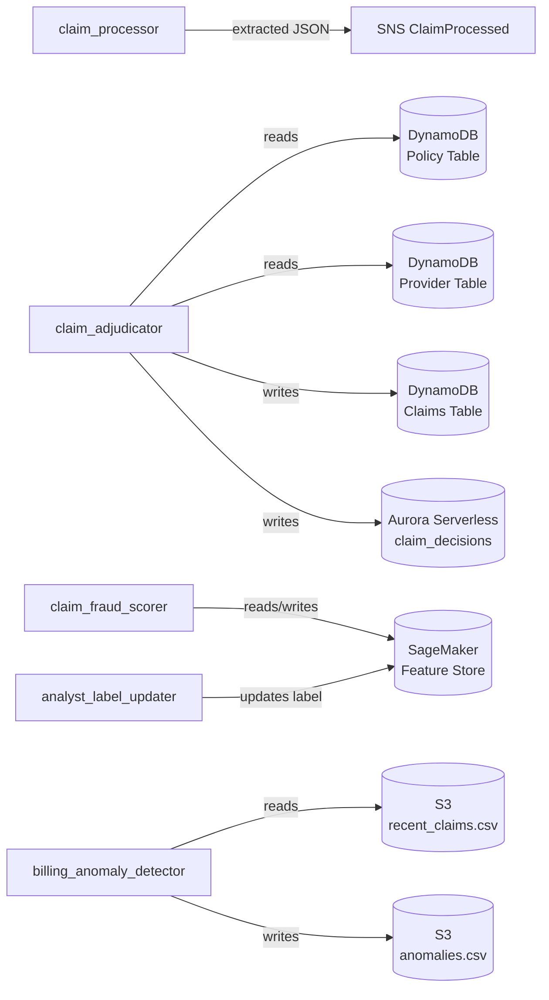

# End-to-End Flow — Medical Insurance Claim Processor

## Project Files

| File | Role |
|------|------|
| `claim_processor.py` | Step 1 — Textract extraction + A2I routing |
| `claim_adjudicator.py` | Step 2 — Policy validation + payout calculation |
| `claim_fraud_scorer.py` | Step 3 — ML fraud scoring + payment routing |
| `billing_anomaly_detector_sagemaker.py` | Parallel — RCF billing anomaly detection |
| `analyst_label_updater.py` | Feedback — analyst labels FRAUD / LEGIT |

---

## Diagram 1 — High-Level Pipeline Overview

---

## Diagram 2 — Step 1: Textract Extraction (`claim_processor.py`)

Triggered by S3 upload. Extracts structured fields and tables from the PDF.

---

## Diagram 3 — Step 2: Adjudication (`claim_adjudicator.py`)

Triggered by SNS. Validates claim against policy rules and calculates payout.

---

## Diagram 4 — Step 3: Fraud Scoring (`claim_fraud_scorer.py`)

Triggered by EventBridge after Step 2 APPROVED. Runs 3 ML signals in parallel.

---

## Diagram 5 — Billing Anomaly Detection (`billing_anomaly_detector_sagemaker.py`)

Runs independently every 15 minutes via EventBridge. Detects inflated billing patterns across all recent claims in batch.

---

## Diagram 6 — Analyst Feedback & Retraining Loop (`analyst_label_updater.py`)

Closes the ML feedback loop. Analyst decisions become training data for the next XGBoost model.

---

## Data Stores Summary

