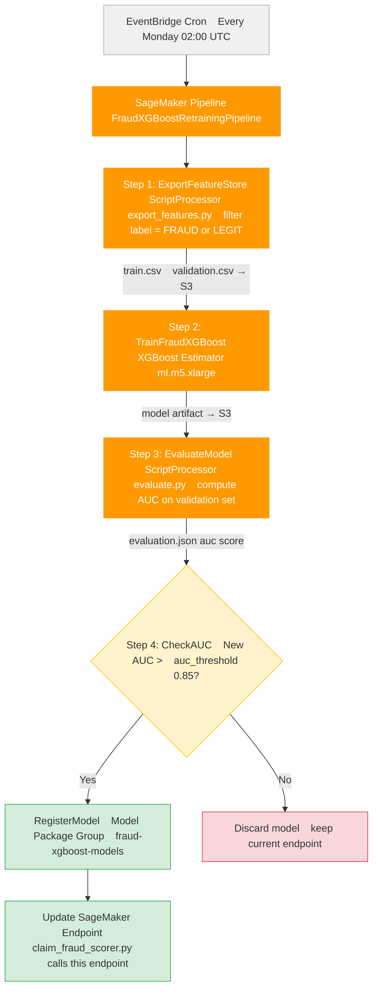
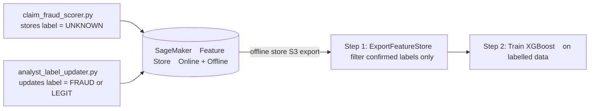
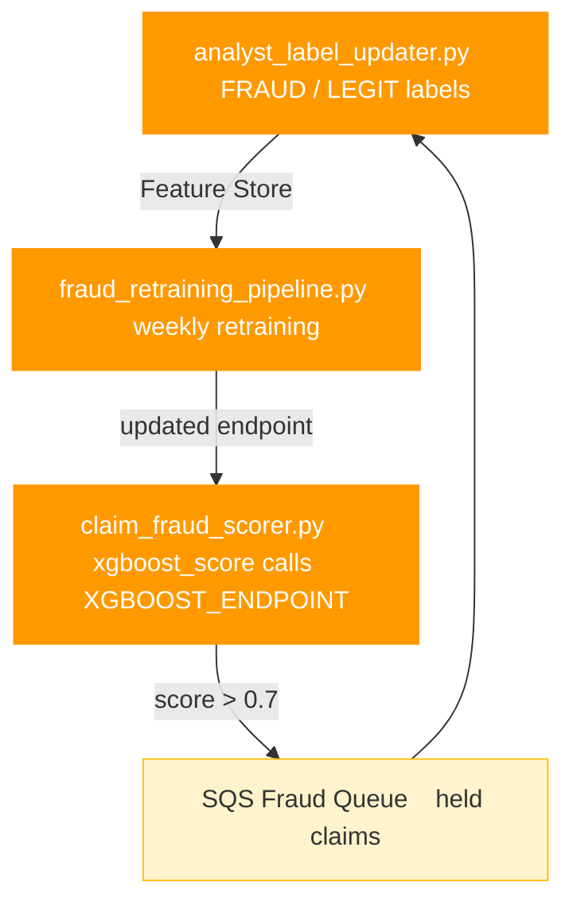

# SageMaker Retraining Pipeline — Fraud XGBoost

## Purpose

`fraud_retraining_pipeline.py` defines a weekly SageMaker Pipeline that:
1. Reads analyst-labelled records from SageMaker Feature Store (written by `analyst_label_updater.py`)
2. Retrains the XGBoost fraud classifier
3. Evaluates the new model AUC
4. Registers and deploys the new model **only if** AUC exceeds the current threshold
5. The updated endpoint is the same one called by `claim_fraud_scorer.py`

---

## Pipeline Steps



---

## Data Flow Into the Pipeline



---

## Pipeline Parameters

| Parameter | Default | Description |
|-----------|---------|-------------|
| `AucThreshold` | `0.85` | Minimum AUC for new model to replace current |
| `InstanceType` | `ml.m5.xlarge` | Training instance — override for larger datasets |

---

## How It Connects to the Rest of the Project



The loop: analyst labels → Feature Store → retrain → better endpoint → fewer false positives → fewer claims for analysts to review.

---

## Infrastructure

| Resource | Config |
|----------|--------|
| Pipeline trigger | EventBridge cron: `cron(0 2 ? * MON *)` |
| Step 1 — Export | `ml.m5.large` × 1, ScriptProcessor |
| Step 2 — Train | `ml.m5.xlarge` × 1, XGBoost 1.7-1 built-in image |
| Step 3 — Evaluate | `ml.m5.large` × 1, ScriptProcessor |
| Model registry | SageMaker Model Package Group: `fraud-xgboost-models` |
| Endpoint updated | Same `XGBOOST_ENDPOINT` used by `claim_fraud_scorer.py` |

---

## IAM Permissions Required

```json
{
  "Effect": "Allow",
  "Action": [
    "sagemaker:CreatePipeline",
    "sagemaker:StartPipelineExecution",
    "sagemaker:CreateTrainingJob",
    "sagemaker:CreateProcessingJob",
    "sagemaker:RegisterModel",
    "sagemaker:UpdateEndpoint",
    "sagemaker-featurestore-runtime:GetRecord",
    "s3:GetObject",
    "s3:PutObject"
  ],
  "Resource": "*"
}
```
