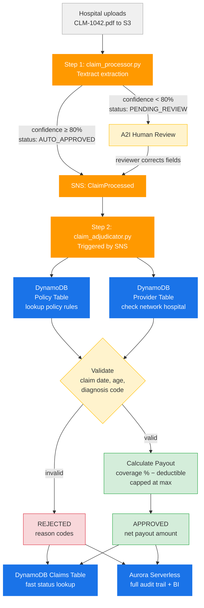
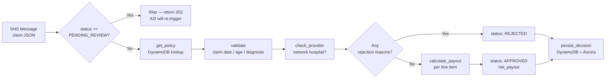
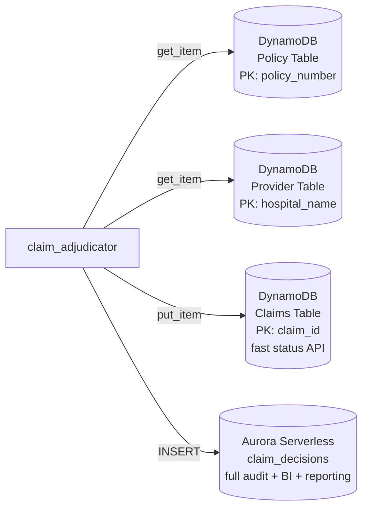

# Step 2 — Claim Adjudication Engine

## What Step 2 Does

Step 1 (`claim_processor.py`) extracts raw structured data from the PDF via Textract.

Step 2 (`claim_adjudicator.py`) takes that extracted JSON and makes a **real business decision**:

| Task | Description |
|------|-------------|
| Policy lookup | Fetch patient's policy from DynamoDB |
| Validation | Check claim date, patient age, diagnosis coverage |
| Provider check | Verify hospital is an approved network provider |
| Payout calculation | Apply coverage %, deductible, max payout cap per line item |
| Persistence | Write decision to DynamoDB (fast lookup) + Aurora (audit/BI) |

---

## Production Use Case

A health insurer processes **~8,000 claims/day**. Before this pipeline, each claim took
2–5 business days with manual data entry. With Steps 1 + 2:

- **Auto-approved** claims (clean scan + valid policy + network provider): settled in **< 30 seconds**
- **Pending review** claims (low-confidence Textract fields): routed to A2I, settled same day
- **Rejected** claims: instant rejection notice with specific reason codes sent to hospital

---

## End-to-End Flow (Step 1 → Step 2)



---

## Step 2 Internal Logic



---

## Payout Calculation Logic

```
gross_payout  = sum(procedure_costs) × coverage_percentage
net_payout    = min(gross_payout − deductible, max_payout_cap)
```

Example from `CLM-1042`:

| Field | Value |
|-------|-------|
| Total billed | $450.50 |
| Coverage % | 80% |
| Gross payout | $360.40 |
| Deductible | $100.00 |
| Net payout | **$260.40** |

---

## Data Stores



| Store | Why |
|-------|-----|
| DynamoDB Policy Table | Sub-millisecond policy lookup at scale |
| DynamoDB Provider Table | Fast in-network check per claim |
| DynamoDB Claims Table | Real-time status API for hospital portal |
| Aurora Serverless | SQL audit trail, finance reporting, BI dashboards |

---

## Validation Rules

| Rule | Rejection Code |
|------|---------------|
| Claim date outside policy active period | `CLAIM_DATE_OUTSIDE_POLICY_PERIOD` |
| Patient age outside covered range | `PATIENT_AGE_NOT_COVERED` |
| Diagnosis code in exclusion list | `DIAGNOSIS_NOT_COVERED: <code>` |
| Hospital not in approved network | `PROVIDER_NOT_IN_NETWORK` |

---

## Infrastructure

| Resource | Config |
|----------|--------|
| Lambda (Step 2) | `claim_adjudicator.py`, 512MB, timeout 30s |
| Trigger | SNS topic `ClaimProcessed` |
| DynamoDB Policy Table | On-demand, GSI on `patient_id` |
| DynamoDB Provider Table | On-demand |
| DynamoDB Claims Table | On-demand, TTL 90 days |
| Aurora Serverless v2 | PostgreSQL, min 0.5 ACU, max 4 ACU |

---

## IAM Permissions (Step 2 Lambda Role)

```json
{
  "Effect": "Allow",
  "Action": [
    "dynamodb:GetItem",
    "dynamodb:PutItem",
    "rds-data:ExecuteStatement",
    "secretsmanager:GetSecretValue",
    "sns:Subscribe"
  ],
  "Resource": "*"
}
```

---

## Project Structure (Full)

```
textract_claim_processor/
├── claim_processor.py      # Step 1: Textract extraction + A2I routing
├── claim_adjudicator.py    # Step 2: Validation + payout + persistence
├── ARCHITECTURE.md         # Step 1 architecture
├── Step2.md                # This file
├── CLAIM_PROCESSOR_DESIGN.md
├── EXAMPLE.md
├── README.md
└── requirements.txt
```
