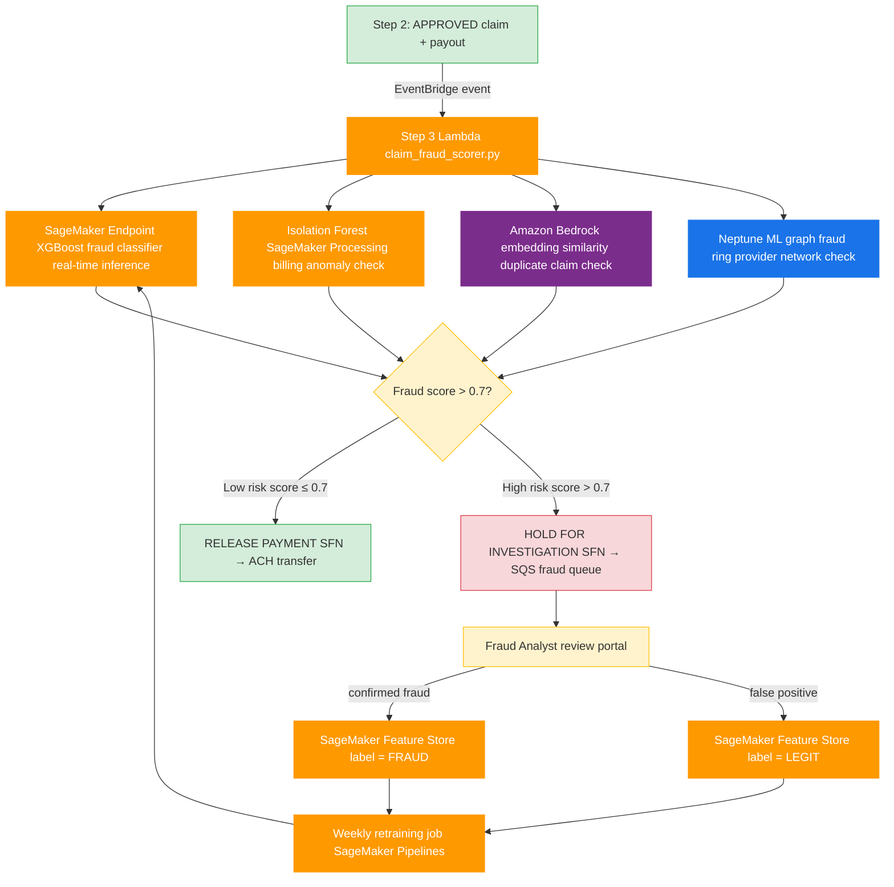
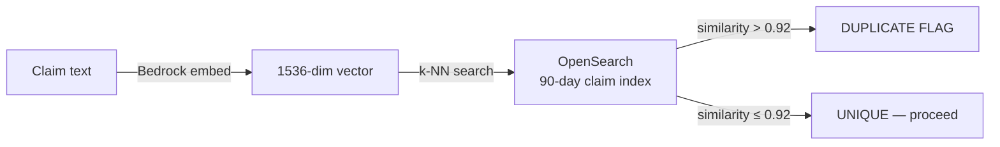
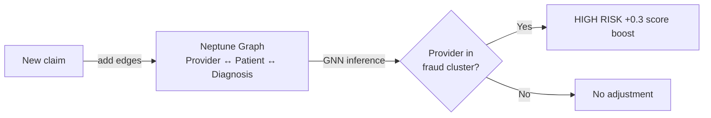
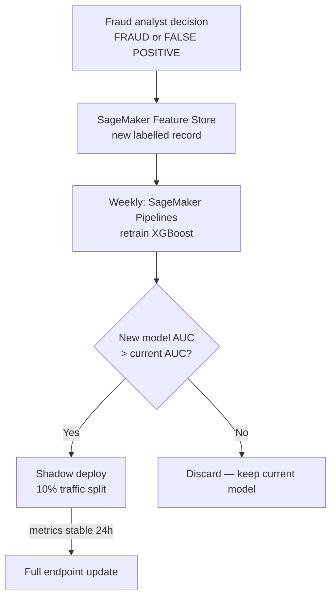

# Step 3 — AI-Powered Fraud Detection & Risk Scoring

## What Step 3 Does

Step 1 extracts. Step 2 validates and pays. Step 3 **learns from every claim** to detect fraud, predict future risk, and continuously improve adjudication accuracy.

| Task | AI/ML Technique |
|------|----------------|
| Real-time fraud scoring per claim | XGBoost classifier (SageMaker endpoint) |
| Anomaly detection on billing patterns | Isolation Forest |
| Duplicate claim detection | Sentence embeddings similarity (Bedrock) |
| Provider fraud ring detection | Graph neural network (Neptune ML) |
| Claim outcome feedback loop | SageMaker Model Monitor + auto-retraining |

---

## Production Use Case

An insurer paying **$2.4B/year** in claims loses ~**$180M/year** (7.5%) to fraud — inflated bills, duplicate submissions, ghost procedures, and provider kickback rings.

Step 3 intercepts claims **before payment is released** (between adjudication decision and bank transfer), scoring each one in real time. Flagged claims are held for investigation. Confirmed fraud is fed back to retrain the model weekly.

> Industry benchmark: ML-based fraud detection recovers 40–60% of fraud losses vs rule-based systems.

---

## End-to-End Flow (Steps 1 → 2 → 3)



---

## ML Models in Detail

### 1. XGBoost Fraud Classifier (Real-Time)

Trained on 3 years of historical claims with confirmed fraud labels.

**Features fed from Steps 1 + 2:**

| Feature | Source |
|---------|--------|
| `net_payout` | Step 2 payout calculation |
| `procedure_count` | Step 1 extracted table row count |
| `days_since_policy_start` | Step 2 policy lookup |
| `provider_claim_frequency_30d` | SageMaker Feature Store |
| `avg_claim_amount_same_diagnosis` | Feature Store (historical) |
| `patient_claim_count_90d` | Feature Store |
| `payout_vs_avg_ratio` | Derived: net_payout / historical avg |

Output: fraud probability score `0.0 – 1.0`

---

### 2. Isolation Forest — Billing Anomaly Detection

Unsupervised. Flags claims where the **combination of procedures and costs** is statistically unusual — e.g. a routine consultation billed at 10× the normal rate.

Runs as a SageMaker Processing Job triggered per claim batch (every 15 min).

---

### 3. Duplicate Claim Detection (Amazon Bedrock)

Converts claim text (patient name + diagnosis + procedures + date) into a vector embedding via Bedrock (`amazon.titan-embed-text-v1`). Compares against embeddings of last 90 days of claims stored in **OpenSearch k-NN index**.

Catches near-duplicates: same claim resubmitted with slightly different dates or procedure codes.



---

### 4. Provider Fraud Ring Detection (Neptune ML)

Graph where nodes = providers, patients, diagnoses. Edges = claim relationships.

Neptune ML (Graph Neural Network) detects **connected fraud rings** — e.g. 3 providers submitting claims for the same 50 patients with identical diagnosis codes, a known kickback pattern.



---

## Feedback Loop — Continuous Learning



Model improves every week as analysts confirm or clear flagged claims.

---

## Risk Score Composition

```
final_score = 0.5 × xgboost_score
            + 0.2 × isolation_forest_score
            + 0.2 × duplicate_similarity_score
            + 0.1 × neptune_cluster_risk_score
```

Threshold `> 0.7` → hold for investigation.
Threshold `> 0.9` → auto-reject + flag provider for audit.

---

## Infrastructure

| Component | Service | Config |
|-----------|---------|--------|
| Step 3 Lambda | `claim_fraud_scorer.py` | 1GB RAM, 60s timeout |
| XGBoost endpoint | SageMaker real-time | `ml.m5.large` × 2, auto-scale |
| Isolation Forest | SageMaker Processing | `ml.m5.xlarge`, every 15 min |
| Embeddings | Amazon Bedrock | `amazon.titan-embed-text-v1` |
| Vector search | OpenSearch Serverless | k-NN index, 90-day TTL |
| Graph DB | Amazon Neptune | `db.r6g.large`, Neptune ML enabled |
| Feature Store | SageMaker Feature Store | Online + offline store |
| Retraining | SageMaker Pipelines | Weekly EventBridge cron |
| Payment release | Step Functions | ACH transfer on low-risk approval |
| Fraud queue | SQS + analyst portal | FIFO, visibility timeout 4h |

---

## IAM Permissions (Step 3 Lambda Role)

```json
{
  "Effect": "Allow",
  "Action": [
    "sagemaker:InvokeEndpoint",
    "bedrock:InvokeModel",
    "es:ESHttpPost",
    "neptune-db:ReadDataViaQuery",
    "sagemaker-featurestore-runtime:PutRecord",
    "states:StartExecution",
    "sqs:SendMessage"
  ],
  "Resource": "*"
}
```

---

## Project Structure (Full Pipeline)

```
textract_claim_processor/
├── claim_processor.py       # Step 1: Textract extraction
├── claim_adjudicator.py     # Step 2: Validation + payout
├── claim_fraud_scorer.py    # Step 3: ML fraud detection (to be implemented)
├── ARCHITECTURE.md
├── Step2.md
├── Step3.md                 # This file
├── EXAMPLE.md
└── README.md
```
