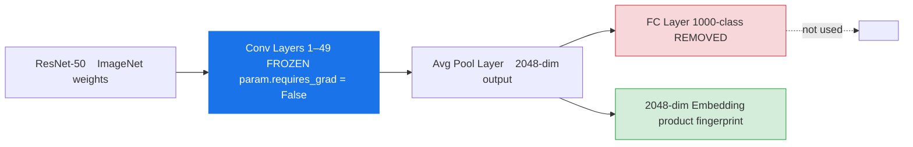
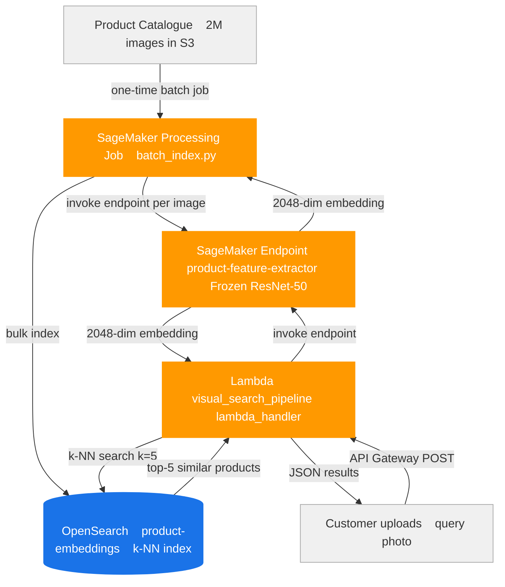
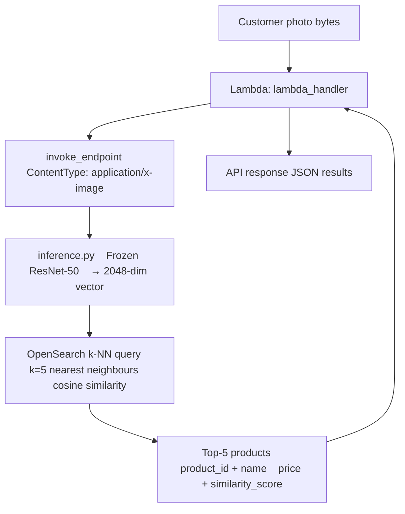

# Visual Product Search — Feature Extraction Architecture

## Use Case

An e-commerce platform with **2M products** wants to let customers search by photo.
Customer points phone camera at a product → app returns visually similar items from catalogue.

**Why feature extraction (not fine-tuning):**
- No labelled training data needed — ImageNet features generalise to product images
- Backbone is frozen — zero GPU training cost
- 2048-dim embeddings are computed once per product and stored
- Adding new products = extract one embedding + one index write, no retraining

---

## Feature Extraction vs Fine-Tuning (This POC)



All gradients are off (`requires_grad=False`). The model is a pure transformation function — image → vector.

---

## End-to-End Architecture



---

## Batch Catalogue Indexing Flow


Run once at launch. For new products: single embedding extraction + index write — no retraining.

---

## Real-Time Search Flow



---

## inference.py — What Makes It Feature Extraction

```python
# Remove final FC layer
model = torch.nn.Sequential(*list(model.children())[:-1])

# Freeze ALL parameters — no gradients, no weight updates
for param in model.parameters():
    param.requires_grad = False
```

These two lines are the definition of feature extraction.
The model is used as a fixed mathematical transformation, not trained.

---

## AWS Services

| Service | Role |
|---------|------|
| S3 | Product catalogue images, model artifact |
| SageMaker Endpoint | Frozen ResNet-50 inference — image → 2048-dim vector |
| SageMaker Processing Job | Batch embedding extraction for full catalogue |
| OpenSearch Serverless | k-NN vector index — stores 2M product embeddings |
| API Gateway | Customer-facing visual search REST API |
| Lambda | Orchestrates query embedding + OpenSearch search |

---

## Project Structure

```
feature_extraction/
├── visual_search_pipeline.py    # endpoint deploy + catalogue index + Lambda handler
├── scripts/
│   ├── inference.py             # SageMaker endpoint — frozen ResNet-50 extractor
│   └── batch_index.py           # Processing Job — bulk embed + index catalogue
└── ARCHITECTURE.md
```

---

## IAM Permissions

```json
{
  "Effect": "Allow",
  "Action": [
    "sagemaker:CreateModel",
    "sagemaker:CreateEndpoint",
    "sagemaker:InvokeEndpoint",
    "sagemaker:CreateProcessingJob",
    "es:ESHttpGet",
    "es:ESHttpPost",
    "es:ESHttpPut",
    "s3:GetObject",
    "s3:PutObject"
  ],
  "Resource": "*"
}
```


For this specific pipeline, end-to-end inference breaks down as:

| Step | Latency |
|------|---------|
| API Gateway overhead | ~5ms |
| Lambda → endpoint network | ~2ms |
| ResNet-50 forward pass (CPU ml.m5.xlarge) | ~80–120ms |
| OpenSearch k-NN search (2M vectors) | ~20–40ms |
| Lambda → API Gateway response | ~2ms |
| Total (p50) | ~110–170ms |

On GPU (ml.g4dn.xlarge): ResNet-50 drops to ~8–15ms → total ~35–60ms

━━━━━━━━━━━━━━━━━━━━━━━━━━━━━━━━━━━━━━━━━━━━━━━━━━━━━━━━━━━━━━━━━━━━━━━━━━━━━━━━━━━━━━━━━━━━━━━━━━━━━━━━━━━━━━━━━━━━━━━━━━━━━━━━━━━━━━━━━━━━━━━━━━━━━━━━━━━━━━━━━━━━━━━━━━━━━━━━━━━━━━━━━━━━━━━━━━━━━━━━━━━━━━


The bottleneck is ResNet-50 on CPU. Two ways to cut it:

1. Switch to a lighter backbone — MobileNetV2 or EfficientNet-B0 gives ~512-dim embeddings in ~15ms on CPU with minimal accuracy loss for product similarity
2. Use GPU instance — ml.g4dn.xlarge is ~4× cheaper per inference than you'd expect and drops latency to under 60ms total

━━━━━━━━━━━━━━━━━━━━━━━━━━━━━━━━━━━━━━━━━━━━━━━━━━━━━━━━━━━━━━━━━━━━━━━━━━━━━━━━━━━━━━━━━━━━━━━━━━━━━━━━━━━━━━━━━━━━━━━━━━━━━━━━━━━━━━━━━━━━━━━━━━━━━━━━━━━━━━━━━━━━━━━━━━━━━━━━━━━━━━━━━━━━━━━━━━━━━━━━━━━━━━


Cold start (if endpoint scales from 0): add ~3–5s for container warm-up. In production you'd set MinCapacity=1 on auto-scaling to keep at least one instance warm — which the deploy() function in 
visual_search_pipeline.py already does.

