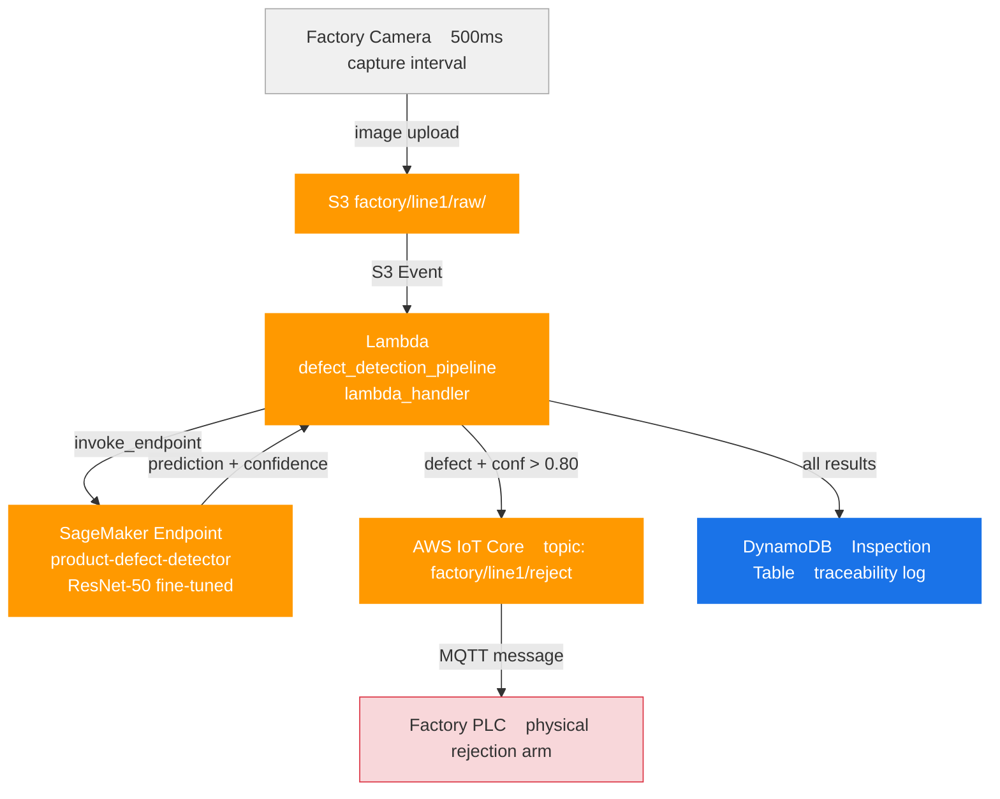
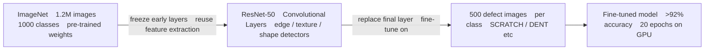
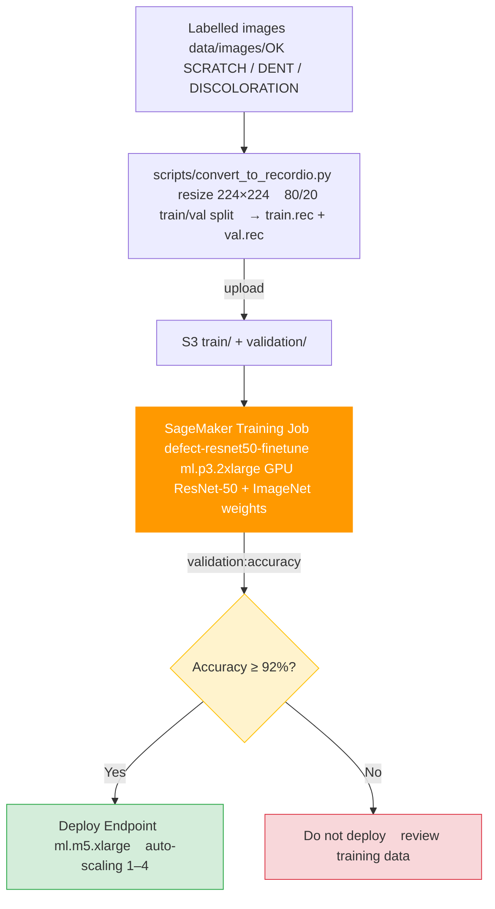
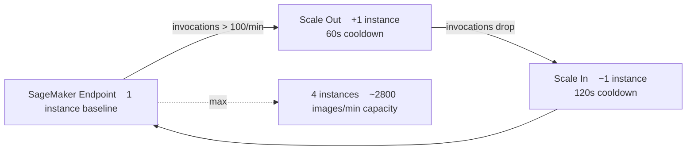
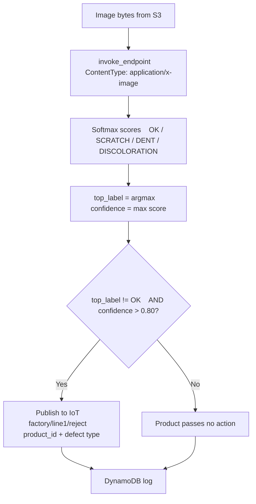

# Product Defect Detection — Transfer Learning Architecture

## Use Case

A consumer electronics manufacturer inspects **~7,000 products/hour** on 3 assembly lines.
Each product is photographed by a camera every 500ms. Defective products must be
physically rejected within **200ms** of detection.

Training a vision model from scratch requires millions of labelled images.
Transfer learning (ResNet-50 pre-trained on ImageNet) achieves **>92% accuracy
with only ~500 labelled defect images** per class — collected in 2 weeks vs 18 months.

**Defect classes:** OK / SCRATCH / DENT / DISCOLORATION

---

## End-to-End Architecture



---

## Transfer Learning — Why It Works Here



Early layers detect universal features (edges, textures, shapes) — identical for product images.
Only the final classification layer is retrained on defect-specific patterns.

---

## Training Pipeline



---

## Endpoint Auto-Scaling



Handles burst traffic when multiple lines run simultaneously or shift changes cause spikes.

---

## Inference Decision Logic



---

## AWS Services

| Service | Role |
|---------|------|
| S3 | Raw images, RecordIO dataset, model artifacts |
| SageMaker Training | ResNet-50 fine-tuning on GPU (`ml.p3.2xlarge`) |
| SageMaker Endpoint | Real-time inference, auto-scaling 1–4 instances |
| AWS Lambda | Orchestrates S3 → endpoint → IoT → DynamoDB |
| AWS IoT Core | MQTT message to factory PLC for physical rejection |
| DynamoDB | Per-product inspection log for traceability/audit |
| Application Auto Scaling | Scale endpoint on invocation rate |
| CloudWatch | Training metrics, endpoint latency alarms |

---

## Transfer Learning vs Training from Scratch

| | From Scratch | Transfer Learning |
|--|-------------|------------------|
| Images needed | ~100,000+ | ~500 per class |
| Training time | Days | ~45 min (20 epochs) |
| GPU cost | ~$200+ | ~$5 |
| Accuracy (500 images) | ~60% | >92% |
| Time to production | Months | Days |

---

## Project Structure

```
transfer_learning/
├── defect_detection_pipeline.py   # training + deployment + Lambda handler
├── scripts/
│   └── convert_to_recordio.py     # image → RecordIO conversion
└── ARCHITECTURE.md
```

---

## IAM Permissions

```json
{
  "Effect": "Allow",
  "Action": [
    "sagemaker:CreateTrainingJob",
    "sagemaker:CreateEndpoint",
    "sagemaker:InvokeEndpoint",
    "application-autoscaling:RegisterScalableTarget",
    "application-autoscaling:PutScalingPolicy",
    "iot:Publish",
    "dynamodb:PutItem",
    "s3:GetObject",
    "s3:PutObject",
    "cloudwatch:GetMetricStatistics"
  ],
  "Resource": "*"
}
```


This is fine-tuning, but it's worth being precise:

What the code does:
python
"use_pretrained_model": 1,   # load ImageNet weights
"epochs": 20,
"learning_rate": 0.001,


SageMaker's built-in Image Classification with use_pretrained_model=1 unfreezes and updates all layers during training — that's fine-tuning, not feature extraction.

━━━━━━━━━━━━━━━━━━━━━━━━━━━━━━━━━━━━━━━━━━━━━━━━━━━━━━━━━━━━━━━━━━━━━━━━━━━━━━━━━━━━━━━━━━━━━━━━━━━━━━━━━━━━━━━━━━━━━━━━━━━━━━━━━━━━━━━━━━━━━━━━━━━━━━━━━━━━━━━━━━━━━━━━━━━━━━━━━━━━━━━━━━━━━━━━━━━━━━━━━━━━━━


The three types compared against this use case:

| Type | Layers trained | When to use | Our case? |
|------|---------------|-------------|-----------|
| Feature Extraction | Final layer only — backbone frozen | Very small dataset (<100 images), source & target domains similar | ❌ |
| Fine-Tuning | All layers (or last N layers) updated with small LR | Moderate dataset (~500+), target domain differs slightly from source | ✅ This one |
| Domain Adaptation | Specialized techniques (adversarial, MMD loss) to bridge large domain gap | Source and target domains are very different (e.g. photos → X-rays → satellite) | ❌ |

━━━━━━━━━━━━━━━━━━━━━━━━━━━━━━━━━━━━━━━━━━━━━━━━━━━━━━━━━━━━━━━━━━━━━━━━━━━━━━━━━━━━━━━━━━━━━━━━━━━━━━━━━━━━━━━━━━━━━━━━━━━━━━━━━━━━━━━━━━━━━━━━━━━━━━━━━━━━━━━━━━━━━━━━━━━━━━━━━━━━━━━━━━━━━━━━━━━━━━━━━━━━━━


Why fine-tuning is the right choice here:

- ImageNet has no product/defect images — the domain gap is real, so freezing the backbone (feature extraction) would underperform
- ~500 images per class is enough to fine-tune without overfitting, especially with augmentation_type: crop_color_transform
- Domain adaptation would be overkill — the gap between ImageNet photos and product photos is moderate, not extreme

If the dataset were <100 images, feature extraction would be safer. If we were adapting from product photos to microscopic material scans, domain adaptation would be needed.

