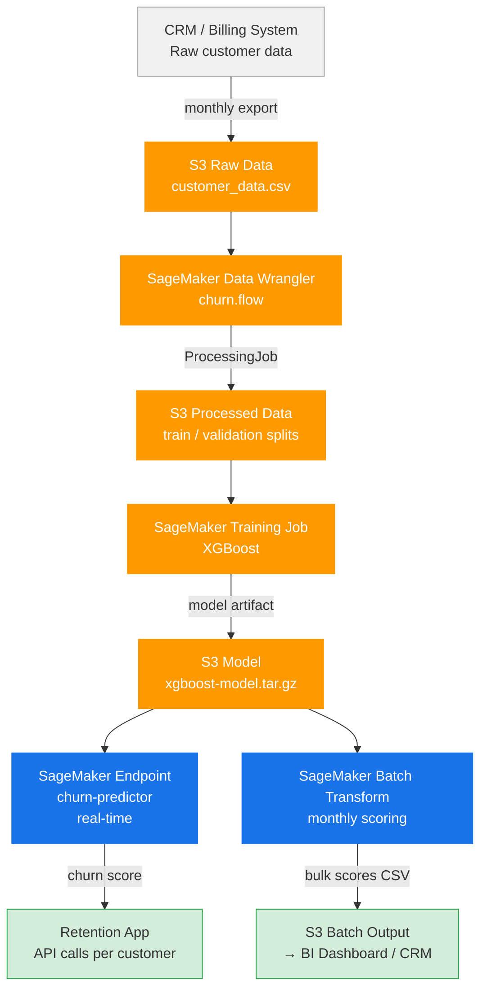
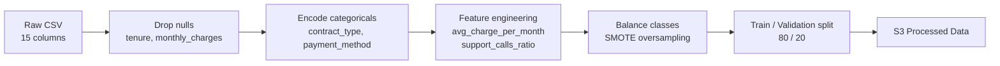
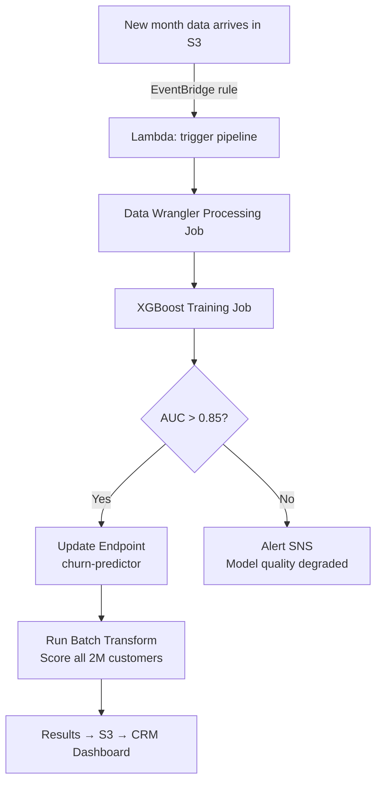

# Customer Churn Prediction — Architecture & Design

## Use Case

A telecom company has ~2M customers. Every month, ~5% churn (cancel subscription).
Retaining a customer costs 5x less than acquiring a new one.

This pipeline automatically scores every customer monthly and flags high-risk ones
for the retention team to act on.

---

## End-to-End Architecture



---

## Data Wrangler Transformation Flow



### Key Transformations in `.flow`

| Step | Transformation | Why |
|------|---------------|-----|
| 1 | Drop rows where `tenure` or `monthly_charges` is null | Required features |
| 2 | One-hot encode `contract_type` (month-to-month, 1yr, 2yr) | XGBoost needs numeric |
| 3 | One-hot encode `payment_method` | Same |
| 4 | `avg_charge_per_month = total_charges / tenure` | Derived signal |
| 5 | `support_calls_ratio = support_calls / tenure` | Frustration signal |
| 6 | SMOTE on minority class (churned=1) | Class imbalance ~5% |
| 7 | 80/20 stratified split | Preserve churn ratio |

---

## Model Design

| Component | Choice | Reason |
|-----------|--------|--------|
| Algorithm | XGBoost | Industry standard for tabular churn, fast, interpretable |
| Metric | AUC-ROC | Handles class imbalance better than accuracy |
| Threshold | 0.35 | Tuned for high recall — better to over-flag than miss churners |
| Retraining | Monthly | Triggered by new data arriving in S3 |

---

## Deployment Design



### Infrastructure

| Resource | Config |
|----------|--------|
| Processing Job | `ml.m5.4xlarge` × 1 |
| Training Job | `ml.m5.xlarge` × 1 |
| Endpoint | `ml.m5.large` × 1 (auto-scaling 1–4) |
| Batch Transform | `ml.m5.xlarge` × 2 |
| Trigger | EventBridge cron: `0 2 1 * *` (1st of month, 2am) |

---

## IAM Permissions Required

```json
{
  "Effect": "Allow",
  "Action": [
    "sagemaker:CreateProcessingJob",
    "sagemaker:CreateTrainingJob",
    "sagemaker:CreateTransformJob",
    "sagemaker:CreateEndpoint",
    "sagemaker:UpdateEndpoint",
    "s3:GetObject",
    "s3:PutObject",
    "sns:Publish"
  ],
  "Resource": "*"
}
```

---

## Project Structure

```
sagemaker_churn/
├── churn_pipeline.py     # orchestrates full pipeline
├── train.py              # XGBoost training entry point
├── churn.flow            # Data Wrangler flow (exported from UI)
└── ARCHITECTURE.md
```
