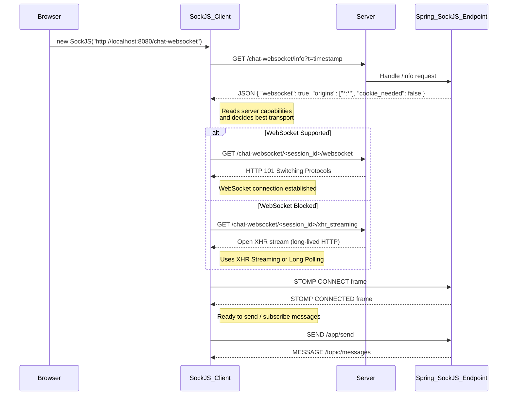

The **`manifest.json`** in a React (or any web) application is primarily used to **configure how your app behaves when installed on a device or used as a Progressive Web App (PWA)**. It tells the browser about your app’s metadata, icons, theme, and how it should appear on the home screen.

Here’s a detailed explanation:

---

## **Key Uses of `manifest.json`**

| Property           | Description                                                                            |
| ------------------ | -------------------------------------------------------------------------------------- |
| `name`             | Full name of your app, used in app stores or install prompts.                          |
| `short_name`       | Shorter name displayed on the device’s home screen.                                    |
| `icons`            | Array of icons of different sizes, used for app shortcut and favicon.                  |
| `start_url`        | URL that should open when the app is launched from home screen or PWA.                 |
| `display`          | Defines how the app is displayed: `standalone`, `fullscreen`, `minimal-ui`, `browser`. |
| `theme_color`      | Defines the color of the browser toolbar or status bar when the app is launched.       |
| `background_color` | Background color used while the app is loading.                                        |

---

## **Why it’s important**

1. **Progressive Web Apps (PWA):**

   * Enables the app to be “installed” like a native app on mobile or desktop.
   * Provides app-like experience (full-screen, no browser URL bar).

2. **Home Screen Shortcuts:**

   * Adds an icon and name when a user saves your web app to their device home screen.

3. **Consistent Branding:**

   * Ensures your app uses the correct icons, theme colors, and name when launched.

---

### **Example Use in React**

```json
{
  "short_name": "ChatApp",
  "name": "React Chat Application",
  "icons": [
    {
      "src": "favicon.ico",
      "sizes": "64x64 32x32 24x24 16x16",
      "type": "image/x-icon"
    }
  ],
  "start_url": ".",
  "display": "standalone",
  "theme_color": "#000000",
  "background_color": "#ffffff"
}
```

* When installed on a device, the app **launches standalone** instead of inside a browser tab.
* Shows **custom icon** and **theme color**.

---

✅ **In short:** `manifest.json` is crucial for PWAs and mobile-friendly behavior but optional for normal web apps. It defines how your app “looks and behaves” when installed or pinned.

I can also explain **how this interacts with service workers to make the chat app work offline**, which is often used together with `manifest.json`.

### index.html
Absolutely! The **`index.html`** file in a React app is the **single HTML file that serves as the entry point for your entire React application**. It’s very different from traditional multi-page apps because React renders all components inside this one HTML file.

Here’s a detailed explanation:

---

## **Key Role of `index.html`**

1. **Mounting Point for React:**

   * The `<div id="root"></div>` in `index.html` is where React injects the entire app.
   * React dynamically updates this DOM node with components and UI.

   ```html
   <div id="root"></div>
   ```

2. **Static HTML Template:**

   * Contains metadata, links to favicon, fonts, meta tags, and other static assets.
   * React uses this template but replaces the `<div id="root"></div>` content dynamically.

3. **Browser Loading Configuration:**

   * Meta tags for viewport, charset, theme-color, description.
   * Ensures proper rendering on mobile devices.

4. **Supports Progressive Web Apps (PWA):**

   * Can reference `manifest.json` for icons, start URL, theme colors.
   * Enables installation on devices as a standalone app.
 

### **Key Points:**

* `%PUBLIC_URL%` is replaced with the base URL when building the app.
* `<noscript>` displays a warning if JavaScript is disabled.
* React never manipulates anything outside `<div id="root">`; everything else is static.
* You can include **analytics scripts, meta tags, or link CSS** in `<head>`.

---

  **In short:** `index.html` is the **foundation** of your React app — a single page where the entire React component tree is mounted and rendered.

I can also **show a diagram of how `index.html`, `index.js`, and React components connect and render dynamically** — it’s a nice visual for beginners.
 

### index.js

For the **React frontend of the chat system**, the `index.js` file in `src/` is the **entry point** where React mounts your application to the DOM.  
 

### **Explanation:**

1. **Imports:**

   * `React` and `ReactDOM` are required for rendering React components.
   * `App` is the root component of the application.
   * `./styles/App.css` imports global styles.

2. **Create Root:**

   ```javascript
   const root = ReactDOM.createRoot(document.getElementById("root"));
   ```

   * Uses the new **React 18 `createRoot` API** for concurrent rendering.
   * Mounts the app to `<div id="root"></div>` in `public/index.html`.

3. **Render App:**

   ```javascript
   root.render(
     <React.StrictMode>
       <App />
     </React.StrictMode>
   );
   ```

   * `<React.StrictMode>` is a development-only wrapper that helps detect potential problems.

---

### ✅ Notes:

* This `index.js` is minimal and sufficient for most small apps.
* All routing, context providers, or state management can be added as **wrappers around `<App />`** if needed.

---
### Styles 

Sure! For the **React chat app frontend**, the `styles/` folder contains **CSS files** for global and component-specific styling. For a minimal working example, here’s how it can be structured:

---

## **Folder structure**

```
styles/
├── App.css
└── Chat.css
```

---

## **1️⃣ App.css** (global styles)

```css
/* src/styles/App.css */

body {
  margin: 0;
  padding: 0;
  font-family: Arial, Helvetica, sans-serif;
  background-color: #f0f2f5;
}

.App {
  display: flex;
  justify-content: center;
  align-items: center;
  height: 100vh;
}

h2 {
  text-align: center;
}
```

* Sets **global font, background**, and **basic layout**.
* The `.App` class centers the main chat container.
 

### **Key Points:**

1. `.chat-window` → container for messages with scrollable overflow.
2. `.message-bubble` → styles each message differently for sender/receiver.
3. `.chat-input` → styles input box and send button.
4. `.user-list` → optional list of online users.

---

✅ **Tip:**

You can **import these styles** in your components:

```javascript
import "../styles/App.css";
import "../styles/Chat.css";
```

---

I can also **prepare a fully integrated CSS with responsive design** so the chat looks good on mobile and desktop.

## Websocket in action :
Sure — let’s go through each part of that line by line.

---

### 🧩 **1. Request URL**

```
ws://localhost:3000/ws
```

This is the **WebSocket URL** being used to establish a connection.

* **`ws://`** → This stands for **WebSocket protocol**.
  It’s similar to how HTTP uses `http://` or `https://`.
  There’s also a secure version: `wss://` (like HTTPS).
* **`localhost`** → Means it’s connecting to a server running on your **own computer**.
* **`3000`** → The **port number** where your WebSocket server is listening.
* **`/ws`** → The **endpoint or path** on that server used to establish the WebSocket connection.

👉 In short:
The client is trying to open a WebSocket connection to a local server on port 3000 at the path `/ws`.

---

### ⚙️ **2. Request Method**

```
GET
```

Although WebSockets are **not HTTP**, the connection **starts as an HTTP GET request**.

Here’s how it works:

* The client first sends a **regular HTTP GET** request to the server.
* It includes special headers like:

  ```
  Upgrade: websocket
  Connection: Upgrade
  ```

  to tell the server:
  “Hey, I’d like to switch this connection from HTTP to WebSocket.”

---

### 🔁 **3. Status Code**

```
101 Switching Protocols
```

This is an **HTTP response status** from the server.

* **`101`** means:
  “I understand your request to switch protocols — let’s switch from HTTP to WebSocket.”
* After this, the connection **upgrades**:

  * It’s no longer HTTP.
  * It becomes a **persistent WebSocket connection**, allowing **bi-directional** (two-way) real-time communication between client and server.

---

### 🧠 **In simple terms**

Here’s what happens step-by-step:

1. The client says:

   > “GET /ws — I want to switch to WebSocket protocol.”

2. The server replies:

   > “101 Switching Protocols — OK, let’s switch.”

3. The connection changes from HTTP to WebSocket:

   * Now both sides can send data to each other **any time**, without new HTTP requests.

---

### ⚡ Example in context:

If you were building a **chat app** or a **real-time dashboard**, this is how the WebSocket handshake would look when your frontend connects to your backend.

**Client (browser):**

```javascript
const socket = new WebSocket("ws://localhost:3000/ws");
```

**Server (Node.js with ws library):**

```javascript
import { WebSocketServer } from 'ws';
const wss = new WebSocketServer({ port: 3000, path: '/ws' });

wss.on('connection', socket => {
  console.log('Client connected');
  socket.send('Hello from server');
});
```

Once the 101 handshake is done — messages can freely go both ways.

---

looking at the **WebSocket handshake headers**, which are key to how the HTTP connection “upgrades” to a WebSocket.

Let’s go through **each of them line by line** and explain what they mean and why they’re needed.

---

## 🧠 Context first:

When a browser or client wants to open a WebSocket, it sends an **HTTP GET** request with these special headers to tell the server:

> “I want to upgrade this HTTP connection into a WebSocket connection.”

If the server agrees, it replies with a `101 Switching Protocols` response, and the connection switches.

Now let’s decode each header 👇

---

### 🔹 `Upgrade: websocket`

This header **requests the protocol switch**.

* It tells the server:
  “I don’t want to use HTTP anymore; let’s upgrade this connection to WebSocket.”
* The server must reply with:

  ```
  Upgrade: websocket
  Connection: Upgrade
  ```

  to confirm the change.

✅ **Purpose:** signals the protocol change.

---

### 🔹 `Sec-WebSocket-Version: 13`

This specifies the **WebSocket protocol version** the client supports.

* Version **13** is the official standardized version (RFC 6455).
* Older versions existed during early drafts, but 13 is what all browsers use now.

✅ **Purpose:** ensures both client and server speak the same WebSocket version.

---

### 🔹 `Sec-WebSocket-Key: C3Us5dJrU6OrDgb6bDK6VA==`

This is a **randomly generated Base64-encoded key** sent by the client.

* It’s used during the handshake to **verify** that the server really understands WebSocket.

* The server takes this key, adds a fixed GUID string to it:

  ```
  C3Us5dJrU6OrDgb6bDK6VA== + "258EAFA5-E914-47DA-95CA-C5AB0DC85B11"
  ```

* Then it hashes that with **SHA-1**, encodes it in Base64, and sends it back as:

  ```
  Sec-WebSocket-Accept: <calculated hash>
  ```

✅ **Purpose:** prevents random HTTP clients from pretending to be WebSocket clients — it’s a **security and protocol validation** step.

---

### 🔹 `Sec-WebSocket-Extensions: permessage-deflate; client_max_window_bits`

This header declares **optional features (extensions)** that the client supports.

Let’s decode this one:

* **`permessage-deflate`** → enables **message compression** using the DEFLATE algorithm (like gzip).
  That means messages are sent in a compressed form to save bandwidth.
* **`client_max_window_bits`** → controls how much memory the compression algorithm uses.
  The “window bits” define the compression buffer size — smaller = less memory.

✅ **Purpose:** negotiate **compression options** to make data transfer more efficient.

If the server also supports these, it replies with the same extension in its response:

```
Sec-WebSocket-Extensions: permessage-deflate
```

---

### 🔹 `Connection: Upgrade`

This header accompanies the `Upgrade` header.

* It tells the server:
  “Please change the current connection to the protocol I listed in the Upgrade header (WebSocket).”

✅ **Purpose:** confirms that this HTTP connection should switch protocols.

---

## 💬 In summary:

| Header                                                                   | Purpose                                            |
| ------------------------------------------------------------------------ | -------------------------------------------------- |
| **Upgrade: websocket**                                                   | Request to switch from HTTP to WebSocket protocol  |
| **Connection: Upgrade**                                                  | Confirms the intent to upgrade the connection      |
| **Sec-WebSocket-Version: 13**                                            | Specifies the WebSocket protocol version           |
| **Sec-WebSocket-Key: ...**                                               | Security key to verify the handshake               |
| **Sec-WebSocket-Extensions: permessage-deflate; client_max_window_bits** | Negotiates compression and other optional features |

---

### ⚡ Example handshake (client → server)

```
GET /ws HTTP/1.1
Host: localhost:3000
Upgrade: websocket
Connection: Upgrade
Sec-WebSocket-Key: C3Us5dJrU6OrDgb6bDK6VA==
Sec-WebSocket-Version: 13
Sec-WebSocket-Extensions: permessage-deflate; client_max_window_bits
```

### 🔁 Server responds:

```
HTTP/1.1 101 Switching Protocols
Upgrade: websocket
Connection: Upgrade
Sec-WebSocket-Accept: q7wJ4BYw6Hk0OMuSbo0SeCO8W8w=
Sec-WebSocket-Extensions: permessage-deflate
```

At this moment, the HTTP connection **switches to WebSocket**, and both sides can send binary/text messages freely.

---

Would you like me to show the **exact step** (with code) where the server takes that `Sec-WebSocket-Key` and generates the `Sec-WebSocket-Accept` value? It’s a neat little cryptographic step that completes the handshake.


### Info Endpoint 
Excellent — you’ve spotted one of those hidden implementation details that explains **why SockJS behaves differently from a normal WebSocket**.

Let’s unpack it clearly 👇

---

## ⚙️ **What is `/chat-websocket/info` in SockJS**

When you use **SockJS** in the browser (e.g., `new SockJS("http://localhost:8080/chat-websocket")`), it doesn’t immediately open a WebSocket connection.

Instead, it starts with an **HTTP “info” request** to:

```
GET /chat-websocket/info?t=<timestamp>
```

---

## 🧩 **Purpose of the `/info` endpoint**

This endpoint is part of the **SockJS protocol**, and it serves several purposes:

| Purpose                              | Description                                                                                  |
| ------------------------------------ | -------------------------------------------------------------------------------------------- |
| 🔍 **Capability Discovery**          | Checks whether the server supports **WebSockets**, **XHR streaming**, **long polling**, etc. |
| 🕹 **CORS & Same-Origin Checks**     | Ensures cross-domain policies allow the connection (CORS headers, cookies, etc.).            |
| ⏱ **Client Heartbeat Configuration** | Returns heartbeat intervals so the client knows how often to send keep-alive signals.        |
| 📜 **Protocol Negotiation**          | Lets client and server agree on the version of SockJS being used.                            |

---

## 🧠 **Example Response from `/info`**

Here’s what a **real SockJS `/info` response** looks like (JSON):

```json
{
  "entropy": 123456789,
  "origins": ["*:*"],
  "cookie_needed": false,
  "websocket": true
}
```

**Meaning:**

* `"entropy"` → random number to help with cache-busting.
* `"origins"` → allowed origins (`*:*` = any).
* `"cookie_needed"` → whether cookies must be sent.
* `"websocket"` → whether native WebSockets are available.

---

## 🧬 **Why SockJS does this**

SockJS is designed to **gracefully fall back** to older techniques if WebSockets aren’t available:

1. Browser tries `GET /chat-websocket/info`
2. Server responds with capabilities.
3. Based on that:

   * Use **WebSocket** if available.
   * Otherwise use **XHR streaming** or **long polling**.
4. Connection is established accordingly.

That’s how **SockJS ensures compatibility** even with old browsers or restrictive proxies/firewalls.

---

## 🧩 **In Spring Boot**

When you call `.withSockJS()` in your WebSocket config:

```java
registry.addEndpoint("/chat-websocket")
        .setAllowedOriginPatterns("*")
        .withSockJS();
```

Spring automatically:

* Registers `/chat-websocket/info`
* Serves the SockJS protocol handlers
* Supports fallback transports

Without `.withSockJS()`, only pure WebSockets are available — no `/info` endpoint is exposed.

---

## 🚀 **Summary**

| Aspect              | Description                                               |
| ------------------- | --------------------------------------------------------- |
| Endpoint            | `/chat-websocket/info`                                    |
| Owner               | SockJS protocol (not your app logic)                      |
| Role                | Performs handshake, feature detection, and fallback setup |
| Added by            | `.withSockJS()` in Spring configuration                   |
| Failure (404) means | Backend didn’t register SockJS endpoint or wrong URL used |

---

✅ **In short:**
`/info` is not part of your chat logic — it’s **SockJS’s internal handshake endpoint** to make sure the browser and server can talk over the best available transport (WebSocket, XHR, or fallback).

---

Would you like me to show the full request–response flow (with `/info`, `/websocket`, and fallback) in a **Mermaid sequence diagram**? It’s a really good visualization of what happens under the hood.

Perfect 👌 — here’s the **Mermaid sequence diagram** showing how the **SockJS handshake and connection flow** works, including the `/info` request and how it falls back to compatible transports when WebSocket isn’t supported.

---

### 🧩 **SockJS Handshake & Connection Flow**



---

### 🧠 **Step-by-step Explanation**

| Step | Action                                    | Description                                            |
| ---- | ----------------------------------------- | ------------------------------------------------------ |
| 1    | `new SockJS()`                            | Browser creates a SockJS client connection             |
| 2    | `GET /chat-websocket/info`                | SockJS client checks server capabilities               |
| 3    | `/info` JSON                              | Server responds with transport & policy info           |
| 4    | Transport selection                       | Client picks WebSocket, XHR streaming, or long polling |
| 5    | `GET /chat-websocket/<session>/websocket` | WebSocket handshake                                    |
| 6    | `101 Switching Protocols`                 | Connection upgraded to WebSocket                       |
| 7    | STOMP frames exchange                     | Client and server establish messaging channel          |
| 8    | `/app/send` & `/topic/messages`           | STOMP app-level communication                          |

---

### ✅ **Key Takeaways**

* `/info` is always the **first request** in the SockJS lifecycle.
* Without `.withSockJS()` in Spring config, `/info` doesn’t exist.
* The **fallback mechanism** allows SockJS to work behind firewalls and older browsers.
* After handshake, **STOMP** protocol runs on top of the chosen transport.

---

Would you like me to extend this diagram to show how the **Spring STOMP broker (SimpleBroker / RabbitMQ)** fits into this flow — i.e., what happens after `/topic/messages` is published?
That gives a full picture from browser → SockJS → Spring → Message Broker → Other Clients.


### Status 

Excellent — you’re looking at a **Spring WebSocket diagnostics summary**, typically printed by the **`WebSocketMessageBrokerStats`** class in Spring Boot.
This gives a **snapshot of your WebSocket and STOMP system health** — what’s happening inside Spring’s messaging engine.

Let’s decode your example piece by piece 👇

---

## 🔍 The full line:

```
WebSocketSession[2 current WS(2)-HttpStream(0)-HttpPoll(0), 2 total, 0 closed abnormally (0 connect failure, 0 send limit, 0 transport error)],
stompSubProtocol[processed CONNECT(2)-CONNECTED(2)-DISCONNECT(0)],
stompBrokerRelay[null],
inboundChannel[pool size = 12, active threads = 0, queued tasks = 0, completed tasks = 12],
outboundChannel[pool size = 2, active threads = 0, queued tasks = 0, completed tasks = 2],
sockJsScheduler[pool size = 8, active threads = 1, queued tasks = 3, completed tasks = 13]
```

---

## 🧩 **1️⃣ WebSocketSession[...]**

```
WebSocketSession[2 current WS(2)-HttpStream(0)-HttpPoll(0), 2 total, 0 closed abnormally (...)]
```

| Field                                                    | Meaning                                                                |
| -------------------------------------------------------- | ---------------------------------------------------------------------- |
| **current WS(2)**                                        | 2 active WebSocket connections (clients currently connected).          |
| **HttpStream(0)**                                        | 0 SockJS HTTP streaming connections.                                   |
| **HttpPoll(0)**                                          | 0 SockJS long-polling connections.                                     |
| **2 total**                                              | Total 2 sessions opened since the server started.                      |
| **0 closed abnormally**                                  | None were closed unexpectedly.                                         |
| **(0 connect failure, 0 send limit, 0 transport error)** | No connection failures, send buffer overflow, or I/O transport errors. |

✅ **Interpretation:**
Your system currently has **2 healthy WebSocket connections** and no errors.

---

## 🧩 **2️⃣ stompSubProtocol[...]**

```
stompSubProtocol[processed CONNECT(2)-CONNECTED(2)-DISCONNECT(0)]
```

| Field             | Meaning                                                                |
| ----------------- | ---------------------------------------------------------------------- |
| **CONNECT(2)**    | 2 STOMP `CONNECT` frames received from clients.                        |
| **CONNECTED(2)**  | 2 STOMP `CONNECTED` frames successfully sent back (handshake success). |
| **DISCONNECT(0)** | No STOMP disconnect frames processed yet.                              |

✅ **Interpretation:**
Two clients have connected and are still connected (no clean disconnects yet).

---

## 🧩 **3️⃣ stompBrokerRelay[null]**

| Field    | Meaning                                                     |
| -------- | ----------------------------------------------------------- |
| **null** | No external STOMP broker relay (like RabbitMQ or ActiveMQ). |

✅ **Interpretation:**
You’re using Spring’s **built-in simple broker**, not an external message broker.

If you were using RabbitMQ with STOMP, this would show relay connection stats.

---

## 🧩 **4️⃣ inboundChannel[...]**

```
inboundChannel[pool size = 12, active threads = 0, queued tasks = 0, completed tasks = 12]
```

| Field                    | Meaning                                                                         |
| ------------------------ | ------------------------------------------------------------------------------- |
| **pool size = 12**       | Thread pool for handling inbound messages from clients (e.g., SEND, SUBSCRIBE). |
| **active threads = 0**   | No messages currently being processed.                                          |
| **queued tasks = 0**     | No pending messages.                                                            |
| **completed tasks = 12** | 12 messages have been processed since startup.                                  |

✅ **Interpretation:**
The inbound executor is idle but has processed 12 messages successfully.

---

## 🧩 **5️⃣ outboundChannel[...]**

```
outboundChannel[pool size = 2, active threads = 0, queued tasks = 0, completed tasks = 2]
```

| Field                   | Meaning                                      |
| ----------------------- | -------------------------------------------- |
| **pool size = 2**       | Thread pool for sending messages to clients. |
| **active threads = 0**  | No messages currently being sent.            |
| **queued tasks = 0**    | Outbound queue empty.                        |
| **completed tasks = 2** | Two messages delivered to clients.           |

✅ **Interpretation:**
Your server has sent 2 messages total and is currently idle.

---

## 🧩 **6️⃣ sockJsScheduler[...]**

```
sockJsScheduler[pool size = 8, active threads = 1, queued tasks = 3, completed tasks = 13]
```

| Field                    | Meaning                                                           |
| ------------------------ | ----------------------------------------------------------------- |
| **pool size = 8**        | Thread pool for SockJS heartbeats, session cleanup, and timeouts. |
| **active threads = 1**   | One background task currently running.                            |
| **queued tasks = 3**     | 3 tasks waiting to be executed.                                   |
| **completed tasks = 13** | 13 SockJS-related housekeeping tasks completed.                   |

✅ **Interpretation:**
SockJS fallback/heartbeat scheduler is working normally.

---

## 🧠 **What this all means**

This log gives a **health snapshot of your WebSocket + STOMP system**:

| Component         | Role                                   | Your System Status         |
| ----------------- | -------------------------------------- | -------------------------- |
| WebSocketSession  | Active WebSocket/SockJS sessions       | 2 connected clients        |
| STOMP Subprotocol | Message protocol handshake             | 2 active sessions          |
| Broker Relay      | External message relay (RabbitMQ etc.) | None (using simple broker) |
| Inbound Channel   | Handles messages from clients          | Idle, 12 processed         |
| Outbound Channel  | Sends messages to clients              | Idle, 2 sent               |
| SockJS Scheduler  | Manages SockJS timers                  | Normal activity            |

---

## ⚙️ **When this is printed**

This line usually appears in logs as:

```
WebSocketMessageBrokerStats : WebSocketSession[...], stompSubProtocol[...], ...
```

Spring automatically prints it every 30 seconds (configurable) to help developers **monitor connection health and throughput**.

---

✅ **Summary**

It’s essentially the **heartbeat/metrics report** for Spring’s STOMP + WebSocket infrastructure:

* Sessions alive ✅
* Message channels idle ✅
* No abnormal closures ✅
* Everything running smoothly ✅

---

Would you like me to show a **Mermaid diagram** of how all these components (WebSocketSession, inbound/outbound channel, simple broker) interact during a `SEND` message from one client to another? It’ll make these metrics much more intuitive visually.

