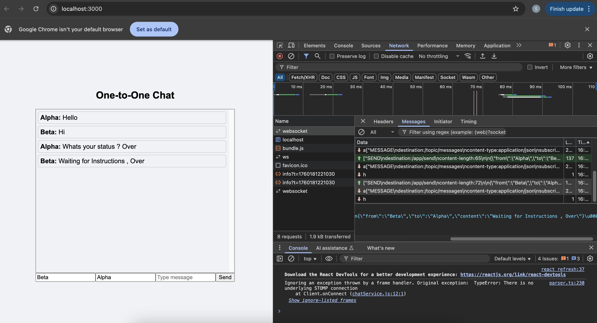

```bash
chat-app/
│
├── backend/                  # Spring Boot backend
│   ├── src/
│   │   ├── main/
│   │   │   ├── java/
│   │   │   │   └── com/example/chat/
│   │   │   │       ├── ChatApplication.java         # Main Spring Boot app
│   │   │   │       ├── config/
│   │   │   │       │   └── WebSocketConfig.java    # WebSocket config
│   │   │   │       ├── controller/
│   │   │   │       │   └── ChatController.java     # REST endpoints if any
│   │   │   │       ├── model/
│   │   │   │       │   └── Message.java            # Chat message entity
│   │   │   │       ├── service/
│   │   │   │       │   └── ChatService.java        # Business logic for messages
│   │   │   │       └── websocket/
│   │   │   │           └── ChatWebSocketHandler.java # WS handler if using STOMP
│   │   │   └── resources/
│   │   │       ├── application.properties
│   │   │       └── static/  # optional static resources
│   │   └── test/java/...     # Unit and integration tests
│   └── pom.xml
│
├── frontend/                 # React JS frontend
│   ├── public/
│   │   ├── index.html
│   │   └── favicon.ico
│   │
│   ├── src/
│   │   ├── api/
│   │   │   └── chatService.js         # WebSocket connect/send/receive
│   │   │
│   │   ├── components/
│   │   │   ├── ChatWindow.js
│   │   │   ├── ChatInput.js
│   │   │   ├── UserList.js
│   │   │   └── MessageBubble.js
│   │   │
│   │   ├── pages/
│   │   │   ├── LoginPage.js
│   │   │   └── ChatPage.js
│   │   │
│   │   ├── hooks/
│   │   │   └── useChat.js              # Custom hook for WS state
│   │   │
│   │   ├── context/
│   │   │   └── ChatContext.js
│   │   │
│   │   ├── styles/
│   │   │   ├── Chat.css
│   │   │   └── App.css
│   │   │
│   │   ├── App.js
│   │   ├── index.js
│   │   └── routes.js
│   │
│   └── package.json
│
└── README.md
```
  
 

## **2️⃣ Commands to Build and Run**

### **Step 1: Navigate to frontend folder**

```bash
cd ~/git/learn/reactjs/chat-system
```

---

### **Step 2: Install dependencies**

```bash
npm install
```

or if you are using yarn:

```bash
yarn install
```

---

### **Step 3: Run the development server**

```bash
npm start
```

* This will start the frontend at `http://localhost:3000`.
* React development server will **hot reload** on file changes.

---

### **Step 4: Build for production**

```bash
npm run build
```

Output should be as below :
```shell
Compiled successfully!

You can now view chat-frontend in the browser.

  Local:            http://localhost:3000
  On Your Network:  http://192.168.1.3:3000

Note that the development build is not optimized.
To create a production build, use npm run build.

webpack compiled successfully


```

* Creates a production-ready build in `chat-frontend/build` folder.
* Can be served with any static server (e.g., Nginx) or integrated into Spring Boot `resources/static` folder.

---

### **Step 5 (optional): Serve the build with Spring Boot**

1. Copy `build` folder to `backend/src/main/resources/static`

```
chat-frontend/build --> backend/src/main/resources/static
```

2. Run Spring Boot application:

```bash
cd backend
mvn spring-boot:run
```

* Spring Boot will serve frontend at `http://localhost:8080`
* WebSocket backend remains active at `/chat-websocket`.

---

✅ **Notes:**

* Frontend runs on port 3000 (dev) and backend on 8080 by default.
* Make sure **CORS is allowed** in `WebSocketConfig` for dev: `setAllowedOrigins("*")`.
* Use `stompjs + sockjs-client` in frontend to connect to WebSocket endpoint.

---
Working APP :



