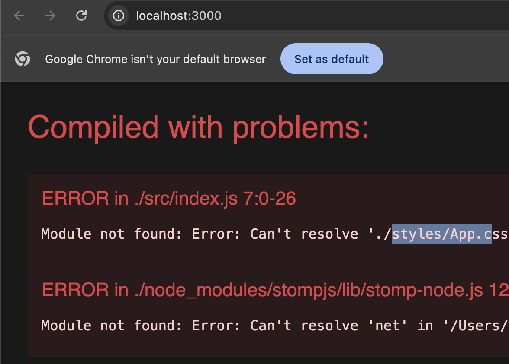

### Missing public folder

```shell
> chat-frontend@1.0.0 start
> react-scripts start

Could not find a required file.
  Name: index.html
  Searched in: /Users/zainabfirdaus/git/learn/reactjs/chat-system/public

```

Create public folder

### Missing index.js
```shell

> chat-frontend@1.0.0 start
> react-scripts start

Could not find a required file.
  Name: index.js
  Searched in: /Users/zainabfirdaus/git/learn/reactjs/chat-system/src
```

Create index.js

### Missing styles


Create Style folder

### Mismatched endpoint in WebsocketConfig

```shell
curl -i 'http://localhost:8246/chat-websocket/info?t=1760166347799' \
  -H 'Accept: */*' \
  -H 'Accept-Language: en-GB,en-US;q=0.9,en;q=0.8' \
  -H 'Connection: keep-alive' \
  -H 'Origin: http://localhost:3000' \
  -H 'Referer: http://localhost:3000/' \
  -H 'Sec-Fetch-Dest: empty' \
  -H 'Sec-Fetch-Mode: cors' \
  -H 'Sec-Fetch-Site: same-site' \
  -H 'User-Agent: Mozilla/5.0 (Macintosh; Intel Mac OS X 10_15_7) AppleWebKit/537.36 (KHTML, like Gecko) Chrome/140.0.0.0 Safari/537.36' \
  -H 'sec-ch-ua: "Chromium";v="140", "Not=A?Brand";v="24", "Google Chrome";v="140"' \
  -H 'sec-ch-ua-mobile: ?0' \
  -H 'sec-ch-ua-platform: "macOS"'
```

